# Software Engineering — Code Blocks & Examples

> Source: https://se.saturngod.net/ — extracted from the chapter HTML for quick reference.

စုစုပေါင်း code block: **105 ခု**
## 1. အခန်း ၁ :: စတင်ခြင်း — Encapsulation

**Language:** `typescript`

**Type:** `example`

**Context**

ကားတစ်စီးမှာ Engine, Break စတာတွေကို ကားမောင်းသူက အသေးစိတ် သိဖို့ မလိုဘူး။​သိဖို့ လိုတာက ဘယ် function တွေက ဘာလုပ်သလဲ ဆိုတာပါပဲ။ Break နင်းရင် ကားရပ် မယ် ဆိုတာမျိုးပေါ့။  ဒီမှာ ကား  ရဲ့ အတွင်း ပိုင်း ဖွဲ့စည်း ပုံက Encapsulation လုပ်ထားပြီး driver က သုံးခွင့် ပေးထားသည့် funciton တွေကို အသုံးပြုနေသည့် သဘောပေါ့။

```typescript
class BankAccount {
    // private property ကို class အပြင်ကနေ တိုက်ရိုက်ခေါ်သုံးလို့မရပါ
    private balance: number;

    constructor(initialBalance: number) {
        this.balance = initialBalance;
    }

    // public method ကနေတစ်ဆင့် private property ကို ဝင်သုံးခွင့်ပေးခြင်း (Getter)
    public getBalance(): number {
        return this.balance;
    }

    // public method ကနေတစ်ဆင့် private property ကို ပြောင်းလဲခွင့်ပေးခြင်း
    public deposit(amount: number): void {
        if (amount > 0) {
            this.balance += amount;
            console.log(`Deposited: ${amount}. New balance: ${this.balance}`);
        }
    }

    public withdraw(amount: number): void {
        if (amount > 0 && amount <= this.balance) {
            this.balance -= amount;
            console.log(`Withdrew: ${amount}. New balance: ${this.balance}`);
        } else {
            console.log('Insufficient funds or invalid amount.');
        }
    }
}

const myAccount = new BankAccount(1000);

// console.log(myAccount.balance); // Error! 'balance' is private. တိုက်ရိုက်ခေါ်လို့မရပါ။

console.log(myAccount.getBalance()); // 1000

myAccount.deposit(500); // Deposited: $500. New balance: $1500
myAccount.withdraw(200); // Withdrew: $200. New balance: $1300
```

## 2. အခန်း ၁ :: စတင်ခြင်း — Inheritance

**Language:** `typescript`

**Type:** `example`

**Context**

Animal ဆိုသည့် ယေဘူယျ class တစ်ခုမှာ စားသည် အိပ်သည် ဆိုသည့် method ရှိမယ်။ Dog class က Animal class ကို inheritance လုပ်လိုက်ရင် eat(), sleep() ဆိုသည့် function တွေက Dog class မှာ ပါပြီး သား ဖြစ်သွားပါမယ်။ Dog မှာ ကတော့ ကိုယ်ပိုင် bark() ဆိုသည့် functrion တစ်ခု ထပ်ဖြည့် ရုံပါပဲ။

```typescript
// Parent Class (Base Class)
class Animal {
    name: string;

    constructor(name: string) {
        this.name = name;
    }

    eat(): void {
        console.log(`${this.name} is eating.`);
    }

    sleep(): void {
        console.log(`${this.name} is sleeping.`);
    }
}

// Child Class (Derived Class) - Animal class ကို အမွေဆက်ခံခြင်း
class Dog extends Animal {
    // ကိုယ်ပိုင် method အသစ်
    bark(): void {
        console.log('Woof! Woof!');
    }
}

class Cat extends Animal {
    // ကိုယ်ပိုင် method အသစ်
    meow(): void {
        console.log('Meow!');
    }
}

const myDog = new Dog('Aung Net');
myDog.eat();   // "Aung Net is eating." (Animal class ကနေ အမွေရထားတာ)
myDog.sleep(); // "Aung Net is sleeping." (Animal class ကနေ အမွေရထားတာ)
myDog.bark();  // "Woof! Woof!" (Dog class ရဲ့ ကိုယ်ပိုင် method)

const myCat = new Cat('Mee Phyu');
myCat.eat();   // "Mee Phyu is eating."
myCat.meow();  // "Meow!"
```

## 3. အခန်း ၁ :: စတင်ခြင်း — Polymorphism

**Language:** `typescript`

**Type:** `example`

**Context**

Animal class မှာ makeSound() ဆိုသည့် method ရှိတယ်။ Dog class က Woof လို့ ဟောင်သည့် ပုံစံ လုပ်ပြီး Cat class က Meow ဆိုပြီး အလုပ်လုပ်စေပါတယ်။

```typescript
class Animal {
    makeSound(): void {
        console.log('Some generic animal sound');
    }
}

class Dog extends Animal {
    // Parent class က makeSound() method ကို Override လုပ်ခြင်း
    makeSound(): void {
        console.log('Woof! Woof!');
    }
}

class Cat extends Animal {
    // Parent class က makeSound() method ကို Override လုပ်ခြင်း
    makeSound(): void {
        console.log('Meow!');
    }
}

class Cow extends Animal {
    // Parent class က makeSound() method ကို Override လုပ်ခြင်း
    makeSound(): void {
        console.log('Moo!');
    }
}

const animals: Animal[] = [new Dog(), new Cat(), new Cow()];

// animals array ထဲက object တစ်ခုချင်းစီဟာ Animal အမျိုးအစားဖြစ်ပေမယ့်၊
// makeSound() ကို ခေါ်လိုက်တဲ့အခါ သူ့ရဲ့ မူလ class အစစ် (Dog, Cat, Cow) က
// override လုပ်ထားတဲ့ method ကိုပဲ အလုပ်လုပ်သွားပါတယ်။
animals.forEach(animal => {
    animal.makeSound();
});

// Output:
// Woof! Woof!
// Meow!
// Moo!
```

## 4. အခန်း ၁ :: စတင်ခြင်း — Abstraction

**Language:** `java`

**Type:** `example`

**Context**

Typescript မှာ abstract မရှိသည့် အတွက် Java ဖြင့် code ဖော်ပြလိုက်ပါတယ်။

```java
// Shape.java

public abstract class Shape {

    // Concrete Method (Implementation ပါတဲ့ သာမန် method)
    // ဒီ class ကို extend လုပ်တဲ့ class တိုင်း ဒီ method ကို အလိုအလျောက် ရရှိပါမယ်။
    public void displayInfo() {
        System.out.println("This is a geometric shape.");
    }

    // Abstract Method (Implementation မပါတဲ့ method)
    // ဒီ class ကို extend လုပ်တဲ့ class တိုင်းက ဒီ method ကို မဖြစ်မနေ implement လုပ်ပေးရပါမယ်။
    public abstract double calculateArea();
}
```

## 5. အခန်း ၁ :: စတင်ခြင်း — Abstraction

**Language:** `java`

**Type:** `example`

**Context**

Typescript မှာ abstract မရှိသည့် အတွက် Java ဖြင့် code ဖော်ပြလိုက်ပါတယ်။

```java
// Circle.java

public class Circle extends Shape {
    private double radius;

    public Circle(double radius) {
        this.radius = radius;
    }

    // Shape class က abstract method ကို Override လုပ်ပြီး implement လုပ်ခြင်း
    @Override
    public double calculateArea() {
        return Math.PI * radius * radius;
    }
}
```

## 6. အခန်း ၁ :: စတင်ခြင်း — Abstraction

**Language:** `java`

**Type:** `example`

**Context**

Typescript မှာ abstract မရှိသည့် အတွက် Java ဖြင့် code ဖော်ပြလိုက်ပါတယ်။

```java
// Rectangle.java

public class Rectangle extends Shape {
    private double width;
    private double height;

    public Rectangle(double width, double height) {
        this.width = width;
        this.height = height;
    }

    // Shape class က abstract method ကို Override လုပ်ပြီး implement လုပ်ခြင်း
    @Override
    public double calculateArea() {
        return width * height;
    }
}
```

## 7. အခန်း ၁ :: စတင်ခြင်း — Abstraction

**Language:** `java`

**Type:** `example`

**Context**

Typescript မှာ abstract မရှိသည့် အတွက် Java ဖြင့် code ဖော်ပြလိုက်ပါတယ်။

```java
// Main.java

public class Main {
    public static void main(String[] args) {
        // Shape myShape = new Shape(); // Error! Abstract class ကို object တိုက်ရိုက်ဆောက်လို့ မရပါ။

        // Concrete class တွေကနေ object ဆောက်ခြင်း
        Shape circle = new Circle(5.0);
        Shape rectangle = new Rectangle(4.0, 6.0);

        // Circle object က သူ့ရဲ့ calculateArea() ကို ခေါ်သုံးခြင်း
        System.out.println("Area of Circle: " + circle.calculateArea());

        // Rectangle object က သူ့ရဲ့ calculateArea() ကို ခေါ်သုံးခြင်း
        System.out.println("Area of Rectangle: " + rectangle.calculateArea());

        // Parent class (Shape) က concrete method ကို ခေါ်သုံးကြည့်ခြင်း
        circle.displayInfo();
    }
}

//output
/*
Area of Circle: 78.53981633974483
Area of Rectangle: 24.0
This is a geometric shape.
*/
```

## 8. အခန်း ၅ :: Software Design and Architecture — Code example

**Language:** `ts`

**Type:** `example`

**Context**

ဥပမာ High Cohesion လို့ ထင်ရပေမယ့် SRP မရှိသည့် class တစ်ခုကို ကြည့်ရအောင်။

```ts
class UserProfile {
    updateUsername(id: number, newName: string) {
        // Update name logic
    }
    updateAvatar(id: number, image: Blob) {
        // Image resizing & upload logic
    }
    changePassword(id: number, newPass: string) {
        // Encryption logic
    }
}
```

## 9. အခန်း ၅ :: Software Design and Architecture — Coupling

**Language:** `ts`

**Type:** `example`

**Context**

ဒီပုံမှာ ဆိုရင် dot လေးတွေက function ဆိုပါဆိုတော့ ။ loose coupling မှာ ဆိုရင် အများကြီး မှီခို မှု မရှိဘူး။ တနည်းပြောရင် တနေရာ ပဲ ရှိတယ်ပေါ့။ high coupling ဆိုရင် ဒီ function ထဲကို ဒီဘက်က data တွေ pass လုပ်ပေးနေရသည့် သဘော။ ဥပမာ MPU Payment ကနေ KBZ Payment ပြောင်းချင်လို့ Product ဘက်က accept payment နေရာမှာ ပြန်ပြင်ရတာမျိုး။ ဥပမာ

```ts
function payment(MPUPayment payment) {
}
```

## 10. အခန်း ၅ :: Software Design and Architecture — Code example

**Language:** `mermaid`

**Type:** `example`

**Context**

အောက်ပါ Diagram မှာ Tradeoff သဘောတရားကို ရှင်းပြထားပါတယ်။ တစ်ဖက်ကို ဆွဲတင်လိုက်ရင် ကျန်တစ်ဖက်က လျော့သွားတတ်တဲ့ သဘောပါ။

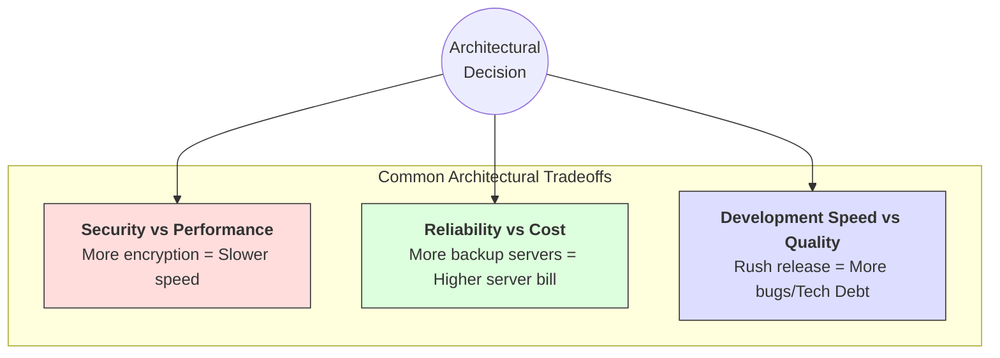
```mermaid
graph TD
    subgraph Tradeoff_Examples [Common Architectural Tradeoffs]
        direction TB

        T1[<b>Security vs Performance</b><br/>More encryption = Slower speed]
        T2[<b>Reliability vs Cost</b><br/>More backup servers = Higher server bill]
        T3[<b>Development Speed vs Quality</b><br/>Rush release = More bugs/Tech Debt]

        style T1 fill:#ffdddd,stroke:#333
        style T2 fill:#ddffdd,stroke:#333
        style T3 fill:#ddddff,stroke:#333
    end

    Decision((Architectural<br/>Decision)) --> T1
    Decision --> T2
    Decision --> T3
```

## 11. အခန်း ၅ :: Software Design and Architecture — ၅.၂.၃ Architecture Documentation and Views (4+1 Model)

**Language:** `mermaid`

**Type:** `code`

**Context**

ဒီပြဿနာကို ဖြေရှင်းဖို့ Philippe Kruchten က 4+1 View Model ကို မိတ်ဆက်ခဲ့ပါတယ်။ သူက စနစ်တစ်ခုကို ရှုထောင့် (View) ၅ ခုခွဲပြီး ကြည့်ဖို့ အကြံပြုထားပါတယ်။ ဒါမှသာ သက်ဆိုင်ရာ Stakeholder တွေက မိမိတို့ လိုအပ်တဲ့ အချက်အလက်ကို ရှင်းရှင်းလင်းလင်း မြင်ရမှာ ဖြစ်ပါတယ်။

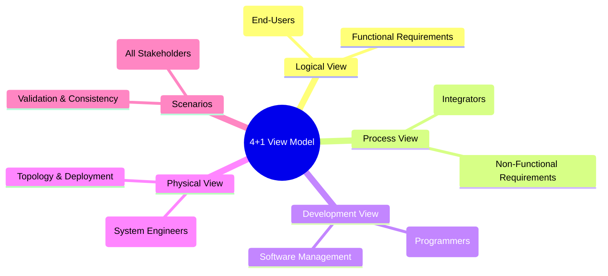
```mermaid
mindmap
  root((4+1 View Model))
    Logical View
      (End-Users)
      ::icon(fa fa-user)
      Functional Requirements
    Process View
      (Integrators)
      ::icon(fa fa-cogs)
      Non-Functional Requirements
    Development View
      (Programmers)
      ::icon(fa fa-code)
      Software Management
    Physical View
      (System Engineers)
      ::icon(fa fa-server)
      Topology & Deployment
    Scenarios
      (All Stakeholders)
      ::icon(fa fa-check-circle)
      Validation & Consistency
```

## 12. အခန်း ၅ :: Software Design and Architecture — Code example

**Language:** `mermaid`

**Type:** `example`

**Context**

အောက်ကပုံမှာ User က Banking System ကို သုံးတယ်။ System ကနေ Email ပို့တာရယ်၊ ငွေစာရင်း သိမ်းထားတဲ့ Mainframe System ကြီးနဲ့ ချိတ်ဆက်တာရယ်ကို မြင်ရမှာပါ။

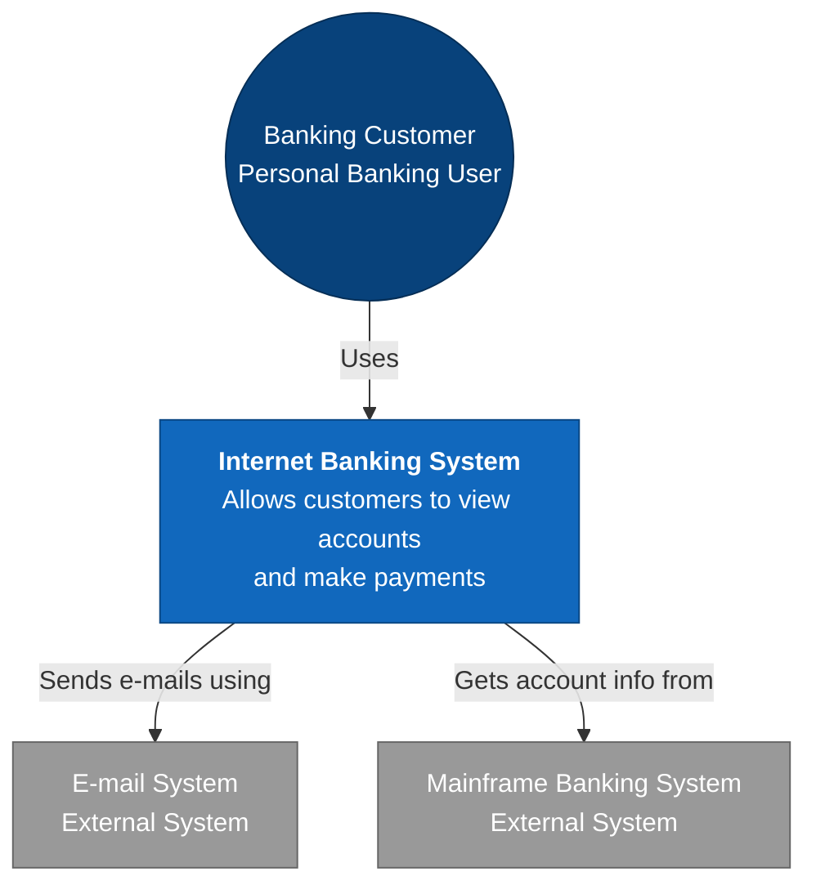
```mermaid
graph TD
    %% Actors
    Customer((Banking Customer<br/>Personal Banking User))

    %% Main System
    System[<b>Internet Banking System</b><br/>Allows customers to view accounts<br/>and make payments]

    %% External Systems
    EmailSys[E-mail System<br/>External System]
    Mainframe[Mainframe Banking System<br/>External System]

    %% Relationships
    Customer -->|Uses| System
    System -->|Sends e-mails using| EmailSys
    System -->|Gets account info from| Mainframe

    %% Styling
    style System fill:#1168bd,stroke:#0b4884,color:white
    style Customer fill:#08427b,stroke:#052e56,color:white
    style EmailSys fill:#999999,stroke:#666666,color:white
    style Mainframe fill:#999999,stroke:#666666,color:white
```

## 13. အခန်း ၅ :: Software Design and Architecture — Code example

**Language:** `mermaid`

**Type:** `example`

**Context**

User က Web App သို့မဟုတ် Mobile App ကနေတဆင့် API ကို လှမ်းခေါ်မယ်။ API ကမှ Database နဲ့ Mainframe ကို ဆက်သွယ်ပြီး အလုပ်လုပ်မယ်ဆိုတာ တွေ့ရမှာပါ။

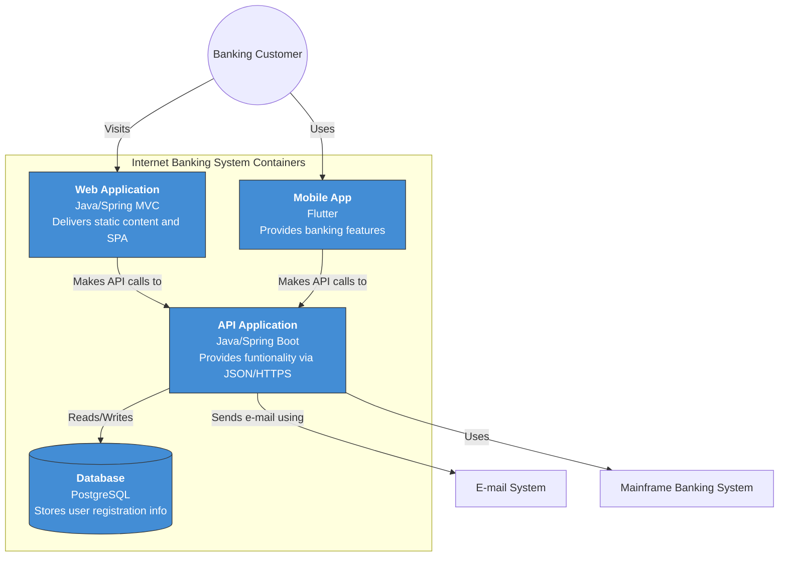
```mermaid
graph TD
    User((Banking Customer))

    subgraph Internet Banking System [Internet Banking System Containers]
        direction TB
        WebApp[<b>Web Application</b><br/>Java/Spring MVC<br/>Delivers static content and SPA]
        MobileApp[<b>Mobile App</b><br/>Flutter<br/>Provides banking features]
        API[<b>API Application</b><br/>Java/Spring Boot<br/>Provides funtionality via JSON/HTTPS]
        DB[(<b>Database</b><br/>PostgreSQL<br/>Stores user registration info)]
    end

    EmailSys[E-mail System]
    Mainframe[Mainframe Banking System]

    %% Relationships
    User -->|Visits| WebApp
    User -->|Uses| MobileApp

    WebApp -->|Makes API calls to| API
    MobileApp -->|Makes API calls to| API

    API -->|Reads/Writes| DB
    API -->|Sends e-mail using| EmailSys
    API -->|Uses| Mainframe

    %% Styling
    style API fill:#438dd5,stroke:#333,color:white
    style WebApp fill:#438dd5,stroke:#333,color:white
    style MobileApp fill:#438dd5,stroke:#333,color:white
    style DB fill:#438dd5,stroke:#333,color:white
```

## 14. အခန်း ၅ :: Software Design and Architecture — Level 3: Component Diagram (The Internal Structure)

**Language:** `mermaid`

**Type:** `example`

**Context**

Banking System Example (API Application အတွင်းပိုင်း):

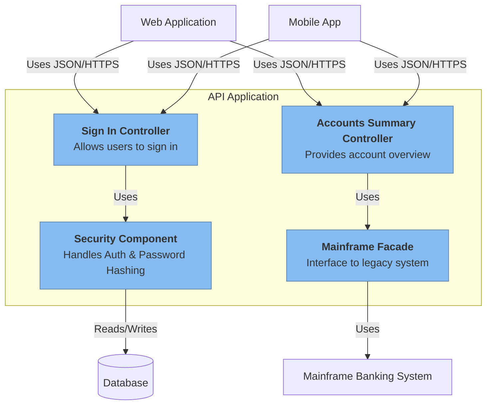
```mermaid
graph TD
    %% External Containers
    WebApp[Web Application]
    MobileApp[Mobile App]
    DB[(Database)]
    Mainframe[Mainframe Banking System]

    %% Internal Components of API Application
    subgraph API_App [API Application]
        SignIn[<b>Sign In Controller</b><br/>Allows users to sign in]
        Accounts[<b>Accounts Summary Controller</b><br/>Provides account overview]
        Security[<b>Security Component</b><br/>Handles Auth & Password Hashing]
        MainframeFacade[<b>Mainframe Facade</b><br/>Interface to legacy system]
    end

    %% Relationships
    WebApp -->|Uses JSON/HTTPS| SignIn
    WebApp -->|Uses JSON/HTTPS| Accounts
    MobileApp -->|Uses JSON/HTTPS| SignIn
    MobileApp -->|Uses JSON/HTTPS| Accounts

    SignIn -->|Uses| Security
    Accounts -->|Uses| MainframeFacade

    Security -->|Reads/Writes| DB
    MainframeFacade -->|Uses| Mainframe

    %% Styling
    style SignIn fill:#85bbf0,stroke:#5d82a8
    style Accounts fill:#85bbf0,stroke:#5d82a8
    style Security fill:#85bbf0,stroke:#5d82a8
    style MainframeFacade fill:#85bbf0,stroke:#5d82a8
```

## 15. အခန်း ၅ :: Software Design and Architecture — Code example

**Language:** `mermaid`

**Type:** `example`

**Context**

လိုချင်တဲ့ Architecture ပုံစံ (ဥပမာ - Microservices) ရှိရင်၊ အဖွဲ့အစည်း ဖွဲ့စည်းပုံကို အရင် ပြောင်းလဲဖို့ လိုကောင်း လိုပါလိမ့်မယ်။ ဒါကို Inverse Conway Maneuver လို့ ခေါ်ပါတယ်။

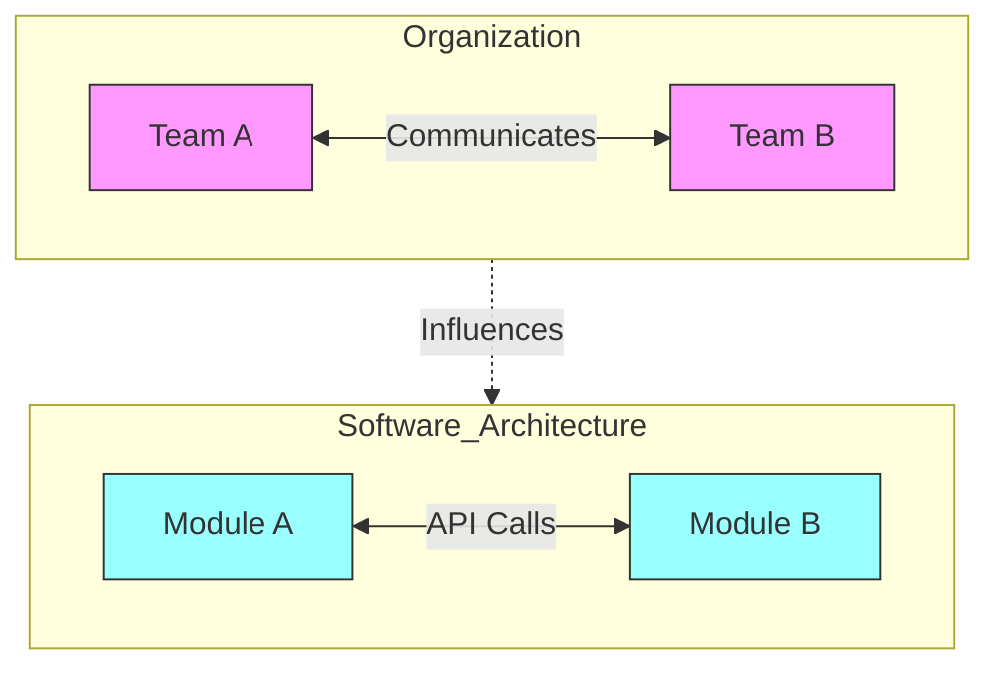
```mermaid
graph TD
    subgraph Organization
        TeamA[Team A] <-->|Communicates| TeamB[Team B]
    end

    subgraph Software_Architecture
        ModuleA[Module A] <-->|API Calls| ModuleB[Module B]
    end

    Organization -.->|Influences| Software_Architecture

    style TeamA fill:#f9f,stroke:#333
    style TeamB fill:#f9f,stroke:#333
    style ModuleA fill:#9ff,stroke:#333
    style ModuleB fill:#9ff,stroke:#333
```

## 16. အခန်း ၅ :: Software Design and Architecture — ၂. CAP Theorem (Distributed Systems Dilemma)

**Language:** `mermaid`

**Type:** `example`

**Context**

Distributed System ဆိုတာ Network ပေါ်မှာ တည်ဆောက်ထားတာဖြစ်လို့ Network ပြတ်တောက်မှု (Partition) က ရှောင်လွှဲမရပါဘူး။ ဒါကြောင့် (P) က မဖြစ်မနေ ယူရမှာ ဖြစ်ပြီး ၊ ကျန်တဲ့ (C) နဲ့ (A) ထဲက တစ်ခုကိုပဲ ရွေးချယ်ခွင့် ရှိပါတော့တယ်။

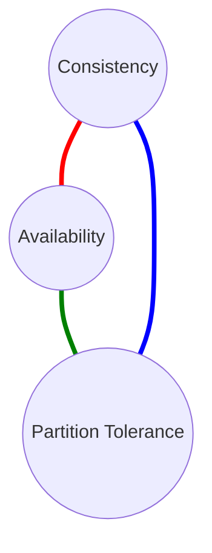
```mermaid
graph TD
    C((Consistency)) --- A((Availability))
    A --- P((Partition Tolerance))
    P --- C

    linkStyle 0 stroke:red,stroke-width:4px;
    linkStyle 1 stroke:green,stroke-width:4px;
    linkStyle 2 stroke:blue,stroke-width:4px;
```

## 17. အခန်း ၅ :: Software Design and Architecture — ၅.၃.၁ Layered Architecture (N-Tier)

**Language:** `mermaid`

**Type:** `code`

**Context**

Software ကို အလွှာ (Layers) တွေအဖြစ် ဖွဲ့စည်းတည်ဆောက်တာ ဖြစ်ပါတယ်။ ဒါက အသုံးအများဆုံးနဲ့ "General Purpose" အဖြစ်ဆုံး Pattern ပါ။ အလွှာတစ်ခုဟာ သူ့အောက်က အလွှာကိုပဲ ဆက်သွယ်ခွင့်ရှိပါတယ်။

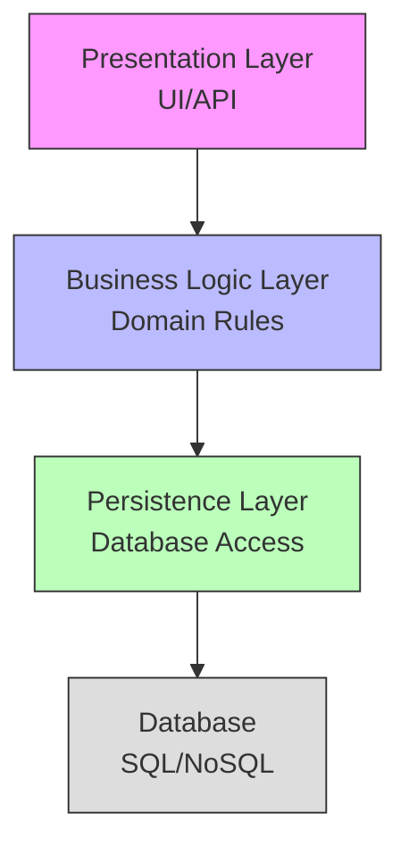
```mermaid
graph TD
    A[Presentation Layer<br/>UI/API] --> B[Business Logic Layer<br/>Domain Rules]
    B --> C[Persistence Layer<br/>Database Access]
    C --> D[Database<br/>SQL/NoSQL]

    style A fill:#f9f,stroke:#333
    style B fill:#bbf,stroke:#333
    style C fill:#bfb,stroke:#333
    style D fill:#ddd,stroke:#333
```

## 18. အခန်း ၅ :: Software Design and Architecture — ၅.၃.၂ Model-View-Controller (MVC) family

**Language:** `mermaid`

**Type:** `code`

**Context**

Interactive Application တွေ (Web & Mobile) အတွက် Standard ဖြစ်နေတဲ့ Pattern ပါ။ UI နဲ့ Logic ကို ရောမနေအောင် ခွဲထုတ်ထားတာပါ။

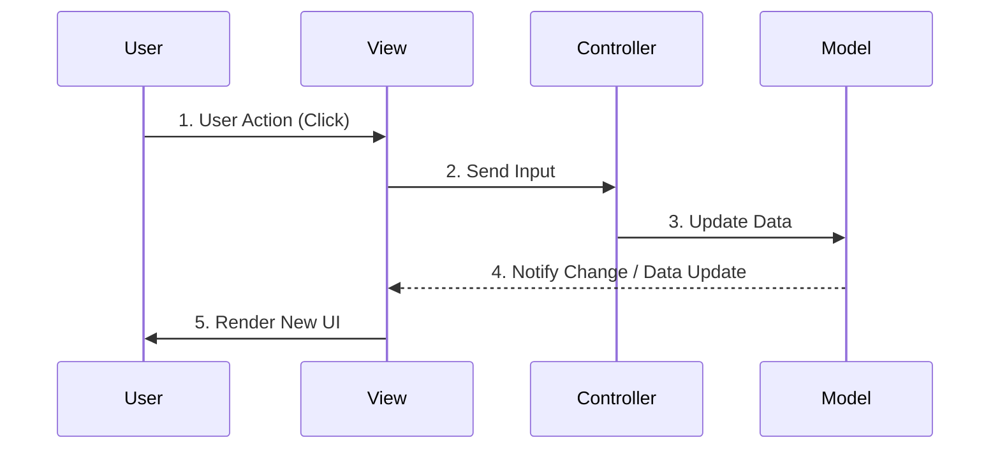
```mermaid
sequenceDiagram
    participant User
    participant View
    participant Controller
    participant Model

    User->>View: 1. User Action (Click)
    View->>Controller: 2. Send Input
    Controller->>Model: 3. Update Data
    Model-->>View: 4. Notify Change / Data Update
    View->>User: 5. Render New UI
```

## 19. အခန်း ၅ :: Software Design and Architecture — ၅.၃.၃ Microkernel Architecture (Plug-in Architecture)

**Language:** `mermaid`

**Type:** `example`

**Context**

ဥပမာ: VS Code, Eclipse, Chrome Browser (Extensions), Wordpress.

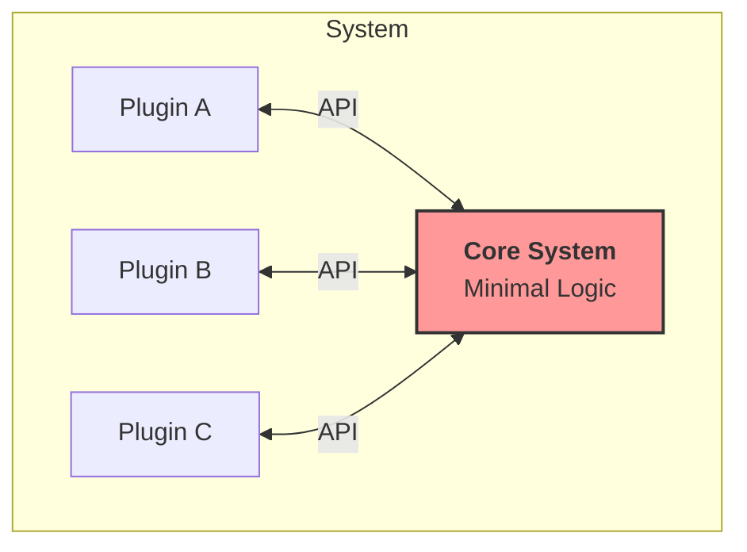
```mermaid
graph TD
    subgraph System
        Core[<b>Core System</b><br/>Minimal Logic]
        P1[Plugin A]
        P2[Plugin B]
        P3[Plugin C]
    end

    P1 <-->|API| Core
    P2 <-->|API| Core
    P3 <-->|API| Core

    style Core fill:#ff9999,stroke:#333,stroke-width:2px
```

## 20. အခန်း ၅ :: Software Design and Architecture — ၅.၃.၄ Pipe-and-Filter Architecture

**Language:** `mermaid`

**Type:** `example`

**Context**

ဥပမာ: Compiler (Lexer -> Parser -> Semantic Analyzer -> Code Generator)၊ Unix Commands ( ls | grep | sort )၊ Video Processing Tools။

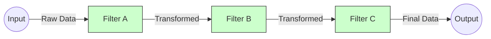
```mermaid
graph LR
    Source((Input)) -->|Raw Data| Filter1[Filter A]
    Filter1 -->|Transformed| Filter2[Filter B]
    Filter2 -->|Transformed| Filter3[Filter C]
    Filter3 -->|Final Data| Sink((Output))

    style Filter1 fill:#cfc,stroke:#333
    style Filter2 fill:#cfc,stroke:#333
    style Filter3 fill:#cfc,stroke:#333
```

## 21. အခန်း ၅ :: Software Design and Architecture — ၅.၄.၁ Microservices Architecture

**Language:** `mermaid`

**Type:** `example`

**Context**

Application ကြီးတစ်ခုလုံးကို Monolith တည်ဆောက်မယ့်အစား၊ သေးငယ်ပြီး လွတ်လပ်တဲ့ Service လေးတွေအဖြစ် ခွဲခြမ်းတည်ဆောက်တာ ဖြစ်ပါတယ်။ Service တစ်ခုချင်းစီဟာ Specific Business Capability (ဥပမာ - Order, Payment, User) တစ်ခုကိုပဲ တာဝန်ယူပြီး၊ သူတို့ရဲ့ ကိုယ်ပိုင် Database သီးသန့် ရှိတတ်ကြပါတယ်။

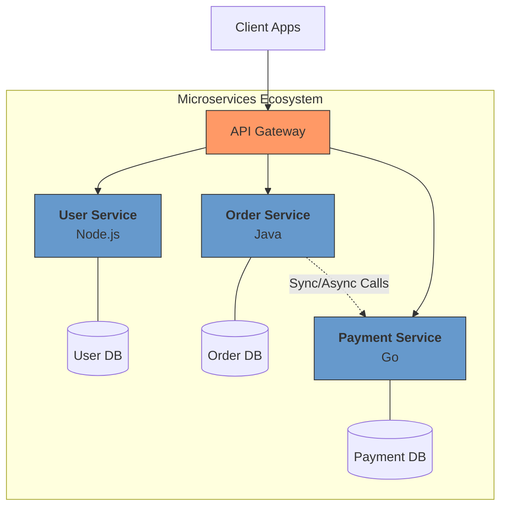
```mermaid
graph TD
    Client[Client Apps] --> GW[API Gateway]

    subgraph Backend [Microservices Ecosystem]
        direction TB
        GW --> S1[<b>User Service</b><br/>Node.js]
        GW --> S2[<b>Order Service</b><br/>Java]
        GW --> S3[<b>Payment Service</b><br/>Go]

        S1 --- DB1[(User DB)]
        S2 --- DB2[(Order DB)]
        S3 --- DB3[(Payment DB)]

        S2 -.->|Sync/Async Calls| S3
    end

    style GW fill:#f96,stroke:#333
    style S1 fill:#69c,stroke:#333
    style S2 fill:#69c,stroke:#333
    style S3 fill:#69c,stroke:#333
```

## 22. အခန်း ၅ :: Software Design and Architecture — ၅.၄.၂ Event-Driven Architecture (EDA)

**Language:** `mermaid`

**Type:** `example`

**Context**

Component တွေက တိုက်ရိုက် ချိတ်ဆက် (Direct Call) မလုပ်ဘဲ၊ Event တွေကို  Publish နဲ့ Subscribe ဖြင့် သွယ်ဝိုက် ဆက်သွယ်ကြပါတယ်။ "Order တက်လာပြီ" လို့ အော်ပြောလိုက်ရင် (Event)၊ သက်ဆိုင်ရာ Payment Service က ကြားပြီး ငွေဖြတ်မယ်၊ Inventory Service က ကြားပြီး ပစ္စည်းစာရင်း ဖြတ်မယ်။

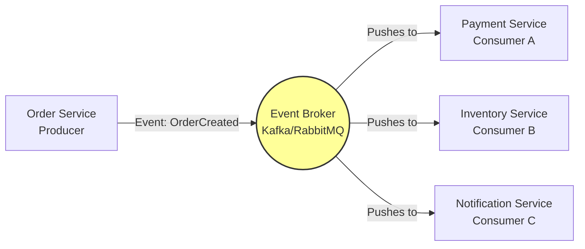
```mermaid
graph LR
    Producer[Order Service<br/>Producer] -- Event: OrderCreated --> Broker((Event Broker<br/>Kafka/RabbitMQ))

    Broker -- Pushes to --> Con1[Payment Service<br/>Consumer A]
    Broker -- Pushes to --> Con2[Inventory Service<br/>Consumer B]
    Broker -- Pushes to --> Con3[Notification Service<br/>Consumer C]

    style Broker fill:#ff9,stroke:#333,stroke-width:2px
```

## 23. အခန်း ၅ :: Software Design and Architecture — ၅.၄.၄ Service-Oriented Architecture (SOA)

**Language:** `mermaid`

**Type:** `code`

**Context**

ဒီပုံမှာ ကြည့်လိုက်ရင် Billing System က Java နဲ့ ရေးထားမယ်၊ HR System က ရှေးဟောင်း Mainframe ကြီး ဖြစ်မယ်။ ဒါပေမဲ့ ESB က ကြားခံပြီး "စကားပြန် (Translator)" အဖြစ် ဆောင်ရွက်ပေးတဲ့အတွက် သူတို့အချင်းချင်း ချိတ်ဆက်လို့ ရသွားပါတယ်။

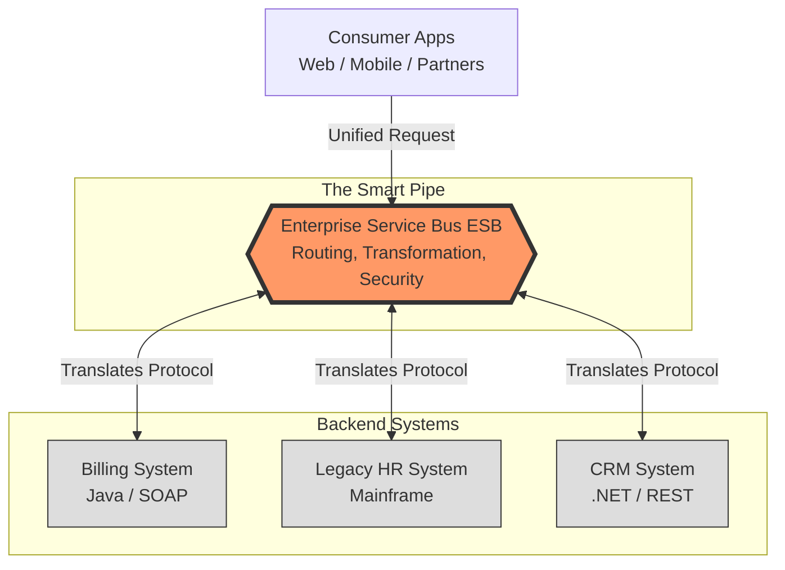
```mermaid
graph TD
    Consumer[Consumer Apps<br/>Web / Mobile / Partners]

    subgraph Middleware [The Smart Pipe]
        ESB{{Enterprise Service Bus ESB<br/>Routing, Transformation, Security}}
    end

    subgraph Enterprise_Services [Backend Systems]
        S1[Billing System<br/>Java / SOAP]
        S2[Legacy HR System<br/>Mainframe]
        S3[CRM System<br/>.NET / REST]
    end

    Consumer -->|Unified Request| ESB
    ESB <-->|Translates Protocol| S1
    ESB <-->|Translates Protocol| S2
    ESB <-->|Translates Protocol| S3

    style ESB fill:#f96,stroke:#333,stroke-width:4px
    style S1 fill:#ddd,stroke:#333
    style S2 fill:#ddd,stroke:#333
    style S3 fill:#ddd,stroke:#333
```

## 24. အခန်း ၅ :: Software Design and Architecture — Code example

**Language:** `java`

**Type:** `example`

**Context**

Java:

```java
// Bad: One class doing two things
class UserService {
    public void registerUser(String username) {
        // Save user logic...
        // Send email logic...
    }
}

// Good: Split responsibilities
class UserRepository {
    public void save(String username) { /* Save logic */ }
}

class EmailService {
    public void sendWelcomeEmail(String username) { /* Email logic */ }
}
```

## 25. အခန်း ၅ :: Software Design and Architecture — Code example

**Language:** `ts`

**Type:** `example`

**Context**

TypeScript:

```ts
// Bad
class UserService {
    registerUser(username: string): void {
        // Save user logic...
        // Send email logic...
    }
}

// Good
class UserRepository {
    save(username: string): void { /* Save logic */ }
}

class EmailService {
    sendWelcomeEmail(username: string): void { /* Email logic */ }
}
```

## 26. အခန်း ၅ :: Software Design and Architecture — Code example

**Language:** `java`

**Type:** `example`

**Context**

Java:

```java
// Good: Use Interface (Polymorphism)
interface PaymentMethod {
    void pay(double amount);
}

class MPUPayment implements PaymentMethod {
    public void pay(double amount) { System.out.println("Paid via MPU"); }
}

class WavePayment implements PaymentMethod {
    public void pay(double amount) { System.out.println("Paid via Wave"); }
}

class PaymentProcessor {
    // New payment methods can be added without changing this code
    public void process(PaymentMethod method, double amount) {
        method.pay(amount);
    }
}
```

## 27. အခန်း ၅ :: Software Design and Architecture — Code example

**Language:** `ts`

**Type:** `example`

**Context**

TypeScript:

```ts
// Good
interface PaymentMethod {
    pay(amount: number): void;
}

class MPUPayment implements PaymentMethod {
    pay(amount: number): void { console.log("Paid via MPU"); }
}

class WavePayment implements PaymentMethod {
    pay(amount: number): void { console.log("Paid via Wave"); }
}

class PaymentProcessor {
    process(method: PaymentMethod, amount: number): void {
        method.pay(amount);
    }
}
```

## 28. အခန်း ၅ :: Software Design and Architecture — Code example

**Language:** `java`

**Type:** `example`

**Context**

Java:

```java
// Bad
interface Worker {
    void work();
    void eat();
}

// Good: Segregate Interfaces
interface Workable {
    void work();
}

interface Eatable {
    void eat();
}

class Robot implements Workable {
    public void work() { /* Working */ }
    // No need to implement eat()
}
```

## 29. အခန်း ၅ :: Software Design and Architecture — Code example

**Language:** `ts`

**Type:** `example`

**Context**

TypeScript:

```ts
// Bad
interface Worker {
    work(): void;
    eat(): void;
}

// Good
interface Workable {
    work(): void;
}

interface Eatable {
    eat(): void;
}

class Robot implements Workable {
    work(): void { /* Working */ }
}
```

## 30. အခန်း ၅ :: Software Design and Architecture — Code example

**Language:** `java`

**Type:** `example`

**Context**

Java:

```java
// Abstraction
interface Switchable {
    void turnOn();
    void turnOff();
}

// Low-level module
class LightBulb implements Switchable {
    public void turnOn() { /* Light on */ }
    public void turnOff() { /* Light off */ }
}

// High-level module
class ElectricSwitch {
    private Switchable device; // Depends on interface, not specific class

    public ElectricSwitch(Switchable device) {
        this.device = device;
    }

    public void press() {
        device.turnOn();
    }
}
```

## 31. အခန်း ၅ :: Software Design and Architecture — Code example

**Language:** `ts`

**Type:** `example`

**Context**

TypeScript:

```ts
// Abstraction
interface Switchable {
    turnOn(): void;
    turnOff(): void;
}

// Low-level module
class LightBulb implements Switchable {
    turnOn(): void { /* Light on */ }
    turnOff(): void { /* Light off */ }
}

// High-level module
class ElectricSwitch {
    private device: Switchable;

    constructor(device: Switchable) {
        this.device = device;
    }

    press(): void {
        this.device.turnOn();
    }
}
```

## 32. အခန်း ၅ :: Software Design and Architecture — ၅.၅.၃ Law of Demeter (Principle of Least Knowledge)

**Language:** `java`

**Type:** `code`

**Context**

Java:

```java
// Bad: Law of Demeter Violation
order.getCustomer().getAddress().getCity();

// Good
order.getCustomerCity();
```

## 33. အခန်း ၅ :: Software Design and Architecture — Code example

**Language:** `ts`

**Type:** `code`

**Context**

TypeScript:

```ts
// Bad
order.customer.address.city;

// Good
order.getCustomerCity();
```

## 34. အခန်း ၅ :: Software Design and Architecture — Code example

**Language:** `java`

**Type:** `example`

**Context**

Java:

```java
class Dog {
    private BarkingBehavior barker = new BarkingBehavior();
    private EatingBehavior eater = new EatingBehavior();

    public void bark() { barker.bark(); }
    public void eat() { eater.eat(); }
}

class RobotDog {
    private BarkingBehavior barker = new BarkingBehavior();
    // No EatingBehavior

    public void bark() { barker.bark(); }
}
```

## 35. အခန်း ၅ :: Software Design and Architecture — Code example

**Language:** `ts`

**Type:** `code`

**Context**

TypeScript:

```ts
class Dog {
    private barker = new BarkingBehavior();
    private eater = new EatingBehavior();

    bark() { this.barker.bark(); }
    eat() { this.eater.eat(); }
}

class RobotDog {
    private barker = new BarkingBehavior();
    // No EatingBehavior

    bark() { this.barker.bark(); }
}
```

## 36. အခန်း ၅ :: Software Design and Architecture — Composition ဖြင့် ချဉ်းကပ်ခြင်း (The Good Way)

**Language:** `java`

**Type:** `code`

**Context**

Java:

```java
// 1. Define the behavior interface
interface AttackStrategy {
    void attack();
}

// 2. Implement specific behaviors
class SwordAttack implements AttackStrategy {
    public void attack() { System.out.println("Swinging a sword!"); }
}

class MagicAttack implements AttackStrategy {
    public void attack() { System.out.println("Casting a fireball!"); }
}

class BowAttack implements AttackStrategy {
    public void attack() { System.out.println("Shooting an arrow!"); }
}

// 3. The main Character class uses Composition
class GameCharacter {
    private AttackStrategy attackStrategy;

    // Inject behavior via constructor
    public GameCharacter(AttackStrategy attackStrategy) {
        this.attackStrategy = attackStrategy;
    }

    // Key Benefit: We can change behavior at runtime!
    public void setWeapon(AttackStrategy newStrategy) {
        this.attackStrategy = newStrategy;
    }

    public void fight() {
        this.attackStrategy.attack();
    }
}

// Usage
public class Main {
    public static void main(String[] args) {
        // Create a Warrior
        GameCharacter player = new GameCharacter(new SwordAttack());
        player.fight(); // Output: Swinging a sword!

        // Suddenly, the player picks up a magic staff
        System.out.println("Player picks up a staff...");
        player.setWeapon(new MagicAttack());
        player.fight(); // Output: Casting a fireball!

        // This dynamic change is impossible with strict Inheritance
    }
}
```

## 37. အခန်း ၅ :: Software Design and Architecture — Composition ဖြင့် ချဉ်းကပ်ခြင်း (The Good Way)

**Language:** `ts`

**Type:** `code`

**Context**

TypeScript:

```ts
// 1. Define the behavior interface
interface AttackStrategy {
    attack(): void;
}

// 2. Implement specific behaviors
class SwordAttack implements AttackStrategy {
    attack(): void { console.log("Swinging a sword!"); }
}

class MagicAttack implements AttackStrategy {
    attack(): void { console.log("Casting a fireball!"); }
}

class BowAttack implements AttackStrategy {
    attack(): void { console.log("Shooting an arrow!"); }
}

// 3. The main Character class uses Composition
class GameCharacter {
    private attackStrategy: AttackStrategy;

    // Inject behavior via constructor
    constructor(attackStrategy: AttackStrategy) {
        this.attackStrategy = attackStrategy;
    }

    // Key Benefit: We can change behavior at runtime!
    setWeapon(newStrategy: AttackStrategy): void {
        this.attackStrategy = newStrategy;
    }

    fight(): void {
        this.attackStrategy.attack();
    }
}

// Usage
// Create a Warrior
const player = new GameCharacter(new SwordAttack());
player.fight(); // Output: Swinging a sword!

// Suddenly, the player picks up a magic staff
console.log("Player picks up a staff...");
player.setWeapon(new MagicAttack());
player.fight(); //
```

## 38. အခန်း ၅ :: Software Design and Architecture — ၁။ Class Diagram:

**Language:** `mermaid`

**Type:** `code`

**Context**

စနစ်ရဲ့ Static Structure ကို ဖော်ပြပါတယ်။ Class တွေ၊ Attribute တွေ၊ Method တွေ၊ နဲ့ သူတို့ကြားက ဆက်ဆံရေး (Inheritance, Composition) တွေကို ပြသပါတယ်။

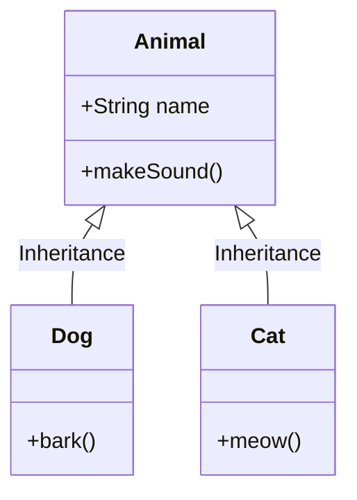
```mermaid
classDiagram
    class Animal {
        +String name
        +makeSound()
    }
    class Dog {
        +bark()
    }
    class Cat {
        +meow()
    }
    Animal <|-- Dog : Inheritance
    Animal <|-- Cat : Inheritance
```

## 39. အခန်း ၅ :: Software Design and Architecture — ၂။ Sequence Diagram:

**Language:** `mermaid`

**Type:** `code`

**Context**

Object တွေဟာ အချိန်နဲ့အမျှ Message တွေ ပေးပို့ခြင်းဖြင့် ဘယ်လို အပြန်အလှန် ဆက်သွယ်သလဲ (Interaction) ဆိုတာကို ဖော်ပြပါတယ်။ Logic Flow ကို နားလည်ဖို့ အလွန်အသုံးဝင်ပါတယ်။

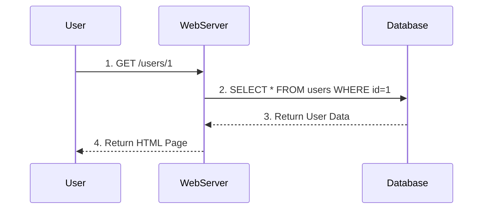
```mermaid
sequenceDiagram
    participant User
    participant WebServer
    participant Database

    User->>WebServer: 1. GET /users/1
    WebServer->>Database: 2. SELECT * FROM users WHERE id=1
    Database-->>WebServer: 3. Return User Data
    WebServer-->>User: 4. Return HTML Page
```

## 40. အခန်း ၅ :: Software Design and Architecture — ၃။ Use Case Diagram:

**Language:** `mermaid`

**Type:** `code`

**Context**

Actor (သုံးစွဲသူ) တွေနဲ့ Use Case (စနစ်ရဲ့ လုပ်ဆောင်ချက်) တွေကြားက ဆက်ဆံရေးကို ဖော်ပြပါတယ်။ Requirement တွေကို မြင်သာအောင် ပြသရာမှာ သုံးပါတယ်။

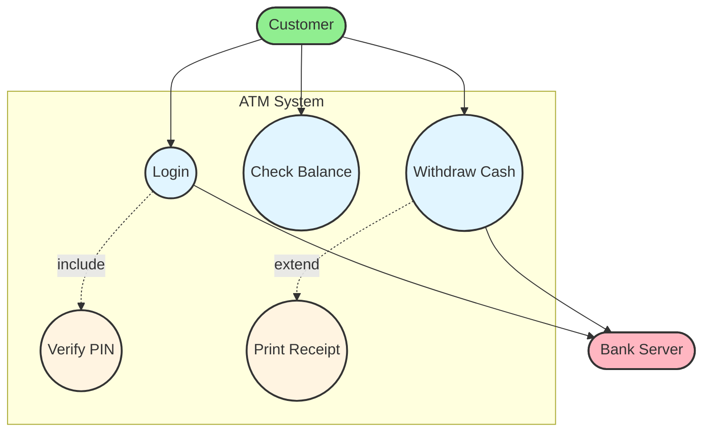
```mermaid
graph TD
    User([Customer])
    Server([Bank Server])

    subgraph ATM_System [ATM System]
        UC1((Login))
        UC2((Check Balance))
        UC3((Withdraw Cash))
        UC4((Verify PIN))
        UC5((Print Receipt))
    end

    User --> UC1
    User --> UC2
    User --> UC3

    UC1 -.->|include| UC4
    UC3 -.->|extend| UC5

    UC1 --> Server
    UC3 --> Server

    style UC1 fill:#e1f5ff,stroke:#333,stroke-width:2px
    style UC2 fill:#e1f5ff,stroke:#333,stroke-width:2px
    style UC3 fill:#e1f5ff,stroke:#333,stroke-width:2px
    style UC4 fill:#fff4e1,stroke:#333,stroke-width:2px
    style UC5 fill:#fff4e1,stroke:#333,stroke-width:2px
    style User fill:#90EE90,stroke:#333,stroke-width:2px
    style Server fill:#FFB6C1,stroke:#333,stroke-width:2px
```

## 41. အခန်း ၅ :: Software Design and Architecture — Code example

**Language:** `mermaid`

**Type:** `code`

**Context**

အောက်ပါ Diagram မှာ E-commerce System တစ်ခုရဲ့ Context နှစ်ခု ကွဲပြားပုံကို ကြည့်ပါ။

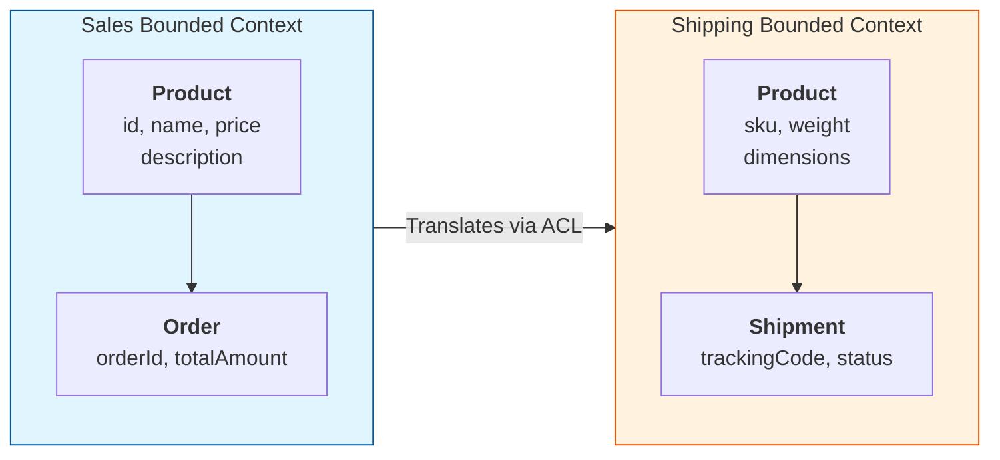
```mermaid
graph LR
    subgraph Sales_Context [Sales Bounded Context]
        direction TB
        SP[<b>Product</b><br/>id, name, price<br/>description]
        Order[<b>Order</b><br/>orderId, totalAmount]
        SP --> Order
    end

    subgraph Shipping_Context [Shipping Bounded Context]
        direction TB
        ShP[<b>Product</b><br/>sku, weight<br/>dimensions]
        Shipment[<b>Shipment</b><br/>trackingCode, status]
        ShP --> Shipment
    end

    Sales_Context -- "Translates via ACL" --> Shipping_Context

    style Sales_Context fill:#e1f5fe,stroke:#01579b
    style Shipping_Context fill:#fff3e0,stroke:#e65100
```

## 42. အခန်း ၅ :: Software Design and Architecture — Code example

**Language:** `mermaid`

**Type:** `example`

**Context**

အောက်ပါ Diagram မှာ Aggregate Boundary ကို ရှင်းပြထားပါတယ်။

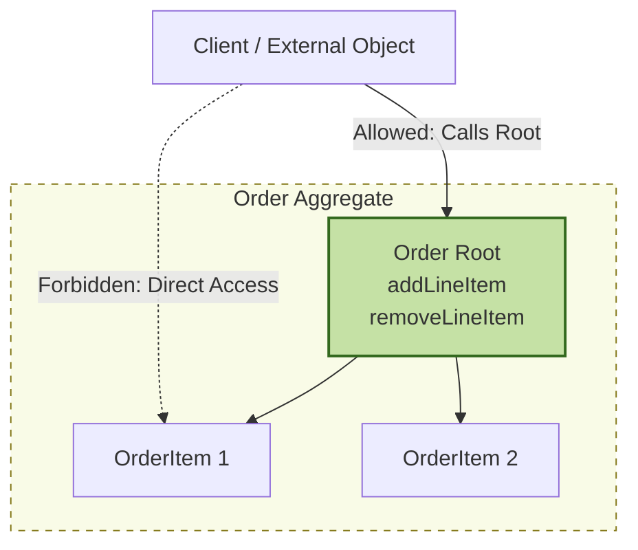
```mermaid
graph TD
    subgraph Aggregate_Boundary [Order Aggregate]
        Order[Order Root<br/>addLineItem<br/>removeLineItem]
        Item1[OrderItem 1]
        Item2[OrderItem 2]

        Order --> Item1
        Order --> Item2
    end

    Client[Client / External Object]

    Client -->|Allowed: Calls Root| Order
    Client -.->|Forbidden: Direct Access| Item1

    style Aggregate_Boundary fill:#f9fbe7,stroke:#827717,stroke-dasharray: 5 5
    style Order fill:#c5e1a5,stroke:#33691e,stroke-width:2px
```

## 43. အခန်း ၅ :: Software Design and Architecture — Code example

**Language:** `mermaid`

**Type:** `example`

**Context**

Entity သို့မဟုတ် Value Object တစ်ခုတည်းနဲ့ မဆိုင်တဲ့ Business Logic တွေကို ရေးသားဖို့ နေရာဖြစ်ပါတယ်။ (ဥပမာ - ငွေလွှဲခြင်း Logic)။ Account တစ်ခုချင်းစီက "ငွေလွှဲတယ်" ဆိုတာကို မသိသင့်ပါဘူး။ သူတို့က "ငွေသွင်း/ငွေထုတ်" (Debit/Credit) ကိုပဲ သိသင့်ပါတယ်။ TransferService က ဒါကို စီမံပေးပါတယ်။

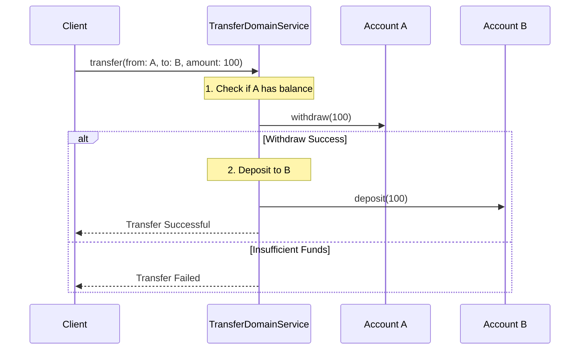
```mermaid
sequenceDiagram
    participant Client
    participant Service as TransferDomainService
    participant AccA as Account A
    participant AccB as Account B

    Client->>Service: transfer(from: A, to: B, amount: 100)

    Note over Service: 1. Check if A has balance
    Service->>AccA: withdraw(100)

    alt Withdraw Success
        Note over Service: 2. Deposit to B
        Service->>AccB: deposit(100)
        Service-->>Client: Transfer Successful
    else Insufficient Funds
        Service-->>Client: Transfer Failed
    end
```

## 44. အခန်း ၅ :: Software Design and Architecture — ၅.၈.၃ Anemic vs. Rich Domain Model

**Language:** `java`

**Type:** `example`

**Context**

Anemic Model (Bad Example):

```java
// Class ထဲမှာ Data ပဲ ရှိတယ်
class Order {
    public List<OrderItem> items;
    public double totalAmount;
    // Getters and Setters...
}

// Logic က Service ထဲ ရောက်နေတယ် (Procedural Code)
class OrderService {
    public void addItem(Order order, Item item) {
        order.getItems().add(item);
        order.setTotalAmount(order.getTotalAmount() + item.getPrice()); // Logic is here!
    }
}
```

## 45. အခန်း ၅ :: Software Design and Architecture — Code example

**Language:** `java`

**Type:** `example`

**Context**

Rich Domain Model (DDD Way):

```java
// Data ရော Logic ရော တစ်နေရာတည်းမှာ ရှိတယ် (OOP)
class Order {
    private List<OrderItem> items;
    private double totalAmount;

    public void addItem(Item item) {
        // Validation Logic
        if (item == null) throw new Error("Item cannot be null");

        // State Change Logic
        this.items.add(item);
        recalculateTotal();
    }

    private void recalculateTotal() {
        this.totalAmount = items.stream().mapToDouble(i -> i.getPrice()).sum();
    }
}
```

## 46. အခန်း ၅ :: Software Design and Architecture — ၅.၈.၄ The Big Picture: DDD Layered Architecture

**Language:** `mermaid`

**Type:** `example`

**Context**

DDD ကို လက်တွေ့ အကောင်အထည်ဖော်တဲ့အခါ Layer ၄ ခု ခွဲပြီး တည်ဆောက်လေ့ရှိပါတယ်။

```mermaid
graph TD
    subgraph Interface_Layer [Interface Layer - Web/API]
        Controller[OrderController]
    end
    subgraph Application_Layer [Application Layer - Use Cases]
        AppService[OrderApplicationService]
    end
    subgraph Domain_Layer [Domain Layer - Business Logic]
        direction TB
        DomainService[PricingService]

        subgraph Aggregate [Order Aggregate]
            Root[Order Root]
            Child[OrderItem]
            Root --> Child
        end

        IRepo[[OrderRepository Interface]]

        AppService --> DomainService
        AppService --> Root
        DomainService --> Root
        Root --> IRepo
    end
    subgraph Infrastructure_Layer [Infrastructure Layer - Technical]
        RepoImpl[OrderRepository Implementation]
        DB[(Database)]

        RepoImpl -.->|Implements| IRepo
        RepoImpl --> DB
    end
    Controller --> AppService

    style Domain_Layer fill:#e8f5e9,stroke:#2e7d32,stroke-width:2px
    style Aggregate fill:#ffffff,stroke:#2e7d32,stroke-dasharray: 5 5
```

## 47. အခန်း ၆ :: Design to Reliable Code — ၆.၂.၁ Feature Branch Workflow

**Language:** `mermaid`

**Type:** `example`

**Context**

ဒီနည်းလမ်းက Code Quality ကို ထိန်းသိမ်းပေးသလို၊ Main Branch ကိုလည်း အမြဲတမ်း Stable ဖြစ်နေစေပါတယ်။

```mermaid
gitGraph
    commit id: "Initial Commit"
    branch feature-login
    commit id: "feat: Add login form" type: HIGHLIGHT
    commit id: "feat: Add password validation" type: HIGHLIGHT
    checkout main
    commit id: "fix: Hotfix on main" type: REVERSE
    branch feature-register
    commit id: "feat: Add register page" type: HIGHLIGHT
    checkout main
    merge feature-login
    checkout feature-register
    commit id: "feat: Add email service" type: HIGHLIGHT
    checkout main
    merge feature-register
```

## 48. အခန်း ၆ :: Design to Reliable Code — Merge vs. Rebase

**Language:** `mermaid`

**Type:** `code`

**Context**

မူလအခြေအနေမှာ main branch နဲ့ feature branch ဘယ်လိုကွဲထွက်နေလဲ ဆိုတာ ကြည့်ကြည့်ရအောင်။

```mermaid
gitGraph
   commit id: "A"
   commit id: "B"
   branch feature
   commit id: "C"
   commit id: "D"
   checkout main
   commit id: "E"
   commit id: "F"
```

## 49. အခန်း ၆ :: Design to Reliable Code — Code example

**Language:** `mermaid`

**Type:** `code`

**Context**

ဒါကတော့ သမိုင်းကြောင်း (History) ကို အရှိအတိုင်း သိမ်းထားတာပါ။ Branch နှစ်ခု ပေါင်းသွားတဲ့ နေရာမှာ "Merge Commit" (G) တစ်ခု ပေါ်လာပါမယ်။ History လမ်းကြောင်းတွေ ခွဲထွက်သွားတာ၊ ပြန်ပေါင်းတာတွေ ရှုပ်ထွေးနိုင်ပေမယ့်၊ ဘာဖြစ်ခဲ့လဲဆိုတာကို အမှန်အတိုင်း (Non-destructive) မြင်ရပါတယ်။

```mermaid
gitGraph
   commit id: "A"
   commit id: "B"
   branch feature
   commit id: "C"
   commit id: "D"
   checkout main
   commit id: "E"
   commit id: "F"
   merge feature id: "G"
```

## 50. အခန်း ၆ :: Design to Reliable Code — Code example

**Language:** `bash`

**Type:** `example`

**Context**

Example

```bash
$ (main)    : git checkout main
$ (main)    : git merge feature
```

## 51. အခန်း ၆ :: Design to Reliable Code — Code example

**Language:** `mermaid`

**Type:** `example`

**Context**

ဒါကတော့ History ကို ပြန်ပြင်ရေးလိုက်တာပါ။ ကိုယ့် Feature Branch ရဲ့ အစ (Base) ကို Main Branch ရဲ့ နောက်ဆုံးအခြေအနေ (Latest Commit) ဆီ ရွှေ့လိုက်တာပါ။ ရလဒ်ကတော့ မျဉ်းဖြောင့်အတိုင်း (Linear History) ဖြစ်သွားပြီး ကြည့်ရ ရှင်းလင်းပါတယ်။

```mermaid
gitGraph
   commit id: "A"
   commit id: "B"
   commit id: "E"
   commit id: "F"
   branch feature
   commit id: "C'"
   commit id: "D'"
   checkout main
   merge feature
```

## 52. အခန်း ၆ :: Design to Reliable Code — Code example

**Language:** `bash`

**Type:** `example`

**Context**

Example

```bash
$ (main)    : git checkout feature
$ (feature) : git rebase main
$ (feature) : git checkout main
$ (main)    : git merge feature
```

## 53. အခန်း ၆ :: Design to Reliable Code — Code example

**Language:** `text`

**Type:** `example`

**Context**

မလုပ်ရ

```
$ (main) : git rebase feature
```

## 54. အခန်း ၆ :: Design to Reliable Code — Code example

**Language:** `text`

**Type:** `example`

**Context**

လုပ်လို့ရသည်

```
$ (feature) : git rebase main
```

## 55. အခန်း ၆ :: Design to Reliable Code — ၆.၂.၂ Commit Message Standards (Conventional Commits)

**Language:** `text`

**Type:** `code`

**Context**

ဒီအတွက် Conventional Commits ဆိုတဲ့ Standard ကို လိုက်နာသင့်ပါတယ်။ ပုံစံကတော့ -

```
<type>(<scope>): <subject>
```

## 56. အခန်း ၆ :: Design to Reliable Code — Example: Inconsistent vs. Standardized (TypeScript)

**Language:** `ts`

**Type:** `example`

**Context**

Without Standard (ဖတ်ရခက်၊ Type Safety မရှိ)

```ts
// Naming မမှန်၊ 'any' type သုံးထား၊ Indentation မညီ
function c(x: any,y: any){
var d=x+y; return d;
    }
```

## 57. အခန်း ၆ :: Design to Reliable Code — Example: Inconsistent vs. Standardized (TypeScript)

**Language:** `ts`

**Type:** `example`

**Context**

With Standard (ရှင်းလင်း၊ Type Safe ဖြစ်)

```ts
// Descriptive Naming၊ Explicit Types၊ Consistent Spacing
function calculateTotal(price: number, tax: number): number {
  const total = price + tax;
  return total;
}
```

## 58. အခန်း ၆ :: Design to Reliable Code — Example: Extract Class Refactoring (TypeScript)

**Language:** `ts`

**Type:** `example`

**Context**

ဒီမှာ Person Class က တာဝန် နှစ်ခု ယူထားပါတယ်။ လူ့အကြောင်းလည်း သိရတယ်၊ လိပ်စာ Format တွေကိုလည်း သိနေရတယ်။

```ts
class Person {
  constructor(
    public name: string,
    public street: string,
    public city: string,
    public zipCode: string
  ) {}

  // လိပ်စာနဲ့ ပတ်သက်တဲ့ Logic တွေက Person ထဲမှာ ရောနေတယ်
  getAddressLabel(): string {
    return `${this.street}, ${this.city} - ${this.zipCode}`;
  }
}
```

## 59. အခန်း ၆ :: Design to Reliable Code — Code example

**Language:** `ts`

**Type:** `example`

**Context**

Address နဲ့ သက်ဆိုင်တဲ့ Logic တွေကို သီးသန့် Class ခွဲထုတ်လိုက်ပါတယ်။

```ts
// 1. Address ကို သီးသန့် Class ခွဲထုတ်လိုက်တယ်
class Address {
  constructor(
    public street: string,
    public city: string,
    public zipCode: string
  ) {}

  // Address နဲ့ ဆိုင်တဲ့ Logic က ဒီမှာပဲ ရှိတော့တယ်
  toLabel(): string {
    return `${this.street}, ${this.city} - ${this.zipCode}`;
  }
}

// 2. Person က Address ကို ယူသုံးရုံပဲ (Compositon)
class Person {
  private address: Address;

  constructor(name: string, address: Address) {
    this.name = name;
    this.address = address;
  }

  public name: string;

  getProfile(): string {
    // Person က Address ရဲ့ အသေးစိတ်ကို သိစရာ မလိုတော့ဘူး
    return `${this.name} lives at ${this.address.toLabel()}`;
  }
}
```

## 60. အခန်း ၆ :: Design to Reliable Code — Code example

**Language:** `mermaid`

**Type:** `code`

**Context**

Result Diagram

```mermaid
classDiagram
    direction TB

    note "Before Refactoring: Monolithic Class"
    class Person_Old {
        +String name
        +String street
        +String city
        +String zipCode
        +getAddressLabel()
    }

    note "After Refactoring: Extract Class"
    class Person_New {
        +String name
        -Address address
        +getProfile()
    }

    class Address {
        +String street
        +String city
        +String zipCode
        +toLabel()
    }

    Person_New *-- Address : Composition
```

## 61. အခန်း ၆ :: Design to Reliable Code — Code example

**Language:** `mermaid`

**Type:** `code`

**Context**

အောက်ပါ Diagram တွင် Decision Point များစွာ ပါဝင်နေသဖြင့် လမ်းကြောင်းများ ရှုပ်ထွေးနေသည်ကို တွေ့မြင်နိုင်ပါသည်။

```mermaid
graph TD
    Start(Start) --> CheckA{Condition A?}
    CheckA -->|True| DoX[Do Action X]
    CheckA -->|False| CheckB{Condition B?}
    CheckB -->|True| DoY[Do Action Y]
    CheckB -->|False| DoZ[Do Action Z]
    DoX --> LoopCheck{Loop?}
    DoY --> LoopCheck
    DoZ --> End(End)
    LoopCheck -->|True| LoopAction[Loop Action]
    LoopAction --> LoopCheck
    LoopCheck -->|False| End
```

## 62. အခန်း ၆ :: Design to Reliable Code — Code example

**Language:** `ts`

**Type:** `example`

**Context**

Bad (Deep Nesting)

```ts
function processPayment(user) {
  if (user != null) {
    if (user.hasBalance) {
      if (user.isActive) {
        // Process Payment logic here...
      }
    }
  }
}
```

## 63. အခန်း ၆ :: Design to Reliable Code — Code example

**Language:** `ts`

**Type:** `example`

**Context**

Good (Guard Clauses)

```ts
function processPayment(user) {
  if (user == null) return;
  if (!user.hasBalance) return;
  if (!user.isActive) return;

  // Process Payment (Logic က ရှင်းသွားပြီ)
}
```

## 64. အခန်း ၆ :: Design to Reliable Code — Code example

**Language:** `ts`

**Type:** `example`

**Context**

Bad Code (Cryptic & Magic Numbers)

```ts
// ဘာလုပ်မှန်း မသိရ၊ 86400 က ဘာလဲ မသိရ၊ Type က any ဖြစ်နေသည်
function c(d: any): number {
  return d * 86400;
}
```

## 65. အခန်း ၆ :: Design to Reliable Code — Code example

**Language:** `ts`

**Type:** `example`

**Context**

Good Code (Self-Documenting)

```ts
const SECONDS_IN_DAY = 86400;

function convertDaysToSeconds(days: number): number {
  return days * SECONDS_IN_DAY;
}
```

## 66. အခန်း ၆ :: Design to Reliable Code — Code example

**Language:** `ts`

**Type:** `example`

**Context**

Example (TypeScript):

```ts
// Bad Comment (Redundant)
// i ကို 1 တိုးသည်
i++;

// Bad Comment (Explaining Syntax)
// Loop through the list backward
for (let i = items.length - 1; i >= 0; i--) { ... }

// Good Comment (Explaining Business Logic / Why)
// We iterate backward because removing items from the array while iterating forward
// would shift indices and cause a bug in item processing.
for (let i = items.length - 1; i >= 0; i--) { ... }
```

## 67. အခန်း ၆ :: Design to Reliable Code — Code example

**Language:** `ts`

**Type:** `example`

**Context**

Developer ရေးထားသည့် Code

```ts
function calculateDiscount(price: number, type: 'vip' | 'regular'): number {
    return type === 'vip' ? price * 0.8 : price * 0.95;
}
```

## 68. အခန်း ၆ :: Design to Reliable Code — Code example

**Language:** `ts`

**Type:** `example`

**Context**

AI က ဖြည့်စွက်ပေးသော Documentation:

```ts
/**
 * Calculates the final price after applying a discount based on user type.
 * @param price - The original price of the item.
 * @param type - The classification of the customer ('vip' gets 20%, 'regular' gets 5%).
 * @returns The final price after discount.
 */
function calculateDiscount(price: number, type: 'vip' | 'regular'): number {
    return type === 'vip' ? price * 0.8 : price * 0.95;
}
```

## 69. အခန်း ၇ :: Software Verification and Validation (V&V) — Code example

**Language:** `mermaid`

**Type:** `example`

**Context**

နောက်ထပ် ဥပမာ တစ်ခု အနေနဲ့ ရှမ်းခေါက်ဆွဲ ဆိုင်တစ်ဆိုင် ဖွင့်တယ်လို့ သဘောထားကြည့်ရအောင်ဗျာ။

```mermaid
graph LR
    subgraph Verification
        direction TB
        V_Q["<b>Are we building the product RIGHT?</b>Specification နဲ့ ကိုက်ညီရဲ့လား?"]
        V_Check["Process: Reviews, Inspections, Static Analysis"]
    end
    subgraph Validation
        direction TB
        Val_Q["<b>Are we building the RIGHT product?</b>User လိုချင်တာ ဟုတ်ရဲ့လား?"]
        Val_Check["Process: UAT, User Feedback, Beta Testing"]
    end
```

## 70. အခန်း ၇ :: Software Verification and Validation (V&V) — ၇.၃ Testing Strategies နှင့် The Testing Pyramid

**Language:** `mermaid`

**Type:** `example`

**Context**

Pyramid ပုံစံ ခိုင်းနှိုင်းထားခြင်းမှာ အောက်ခြေ (Unit Test) ကို အများဆုံး တည်ဆောက်ရမည် ဖြစ်ပြီး၊ ထိပ်ဆုံး (E2E Test) ကို အနည်းဆုံး ထားရမည် ဟု ဆိုလိုခြင်း ဖြစ်သည်။

```mermaid
graph TD
    subgraph "The Testing Pyramid"
        direction TB
        A["<b>UI / End-to-End Tests (10%)</b><br/><i>Slow, expensive, brittle</i>"] --> B["<b>Integration Tests (20%)</b><br/><i>Test component connections</i>"]
        B --> C["<b>Unit Tests (70%)</b><br/><i>Fast, cheap, should be majority</i>"]
    end
    style A fill:#ffcccc,stroke:#333
    style B fill:#ffffcc,stroke:#333
    style C fill:#ccffcc,stroke:#333
```

## 71. အခန်း ၇ :: Software Verification and Validation (V&V) — 1. Unit Testing (အောက်ခြေဖောင်ဒေးရှင်း)

**Language:** `ts`

**Type:** `example`

**Context**

စျေးဝယ်လှည်း (Cart) ထဲက ပစ္စည်းတန်ဖိုး စုစုပေါင်း တွက်တဲ့ Function ကို စစ်ကြည့်ရအောင်။

```ts
// src/cart.ts
export function calculateTotal(items: { price: number; qty: number }[]): number {
  return items.reduce((total, item) => total + item.price * item.qty, 0);
}

// tests/cart.test.ts
import { calculateTotal } from '../src/cart';

describe('Cart Calculator', () => {
  it('should calculate total price correctly', () => {
    const items = [
      { price: 100, qty: 2 }, // 200
      { price: 50, qty: 1 }   // 50
    ];

    expect(calculateTotal(items)).toBe(250);
  });

  it('should return 0 for empty cart', () => {
    expect(calculateTotal([])).toBe(0);
  });
});
```

## 72. အခန်း ၈ :: Fundamental Principles of Software Engineering — Code example

**Language:** `mermaid`

**Type:** `example`

**Context**

ဟူ၍ ခွဲခြားထားသင့်သည်။ ဤအချက်သည် အခန်း ၅ မှာ ဖော်ပြထားသည့် Layered Architecture နှင့် MVC Pattern တို့၏ အဓိက သဘောတရား ဖြစ်သည်။

```mermaid
graph TD
    subgraph "Without SoC (Spaghetti Code)"
        A["<b>Monolithic / God Component</b>UI ရော၊ တွက်ချက်တာရော၊Database ခေါ်တာရောတစ်နေရာတည်း ရောရေးထားခြင်း"]
    end

    subgraph "With SoC (Clean Architecture)"
        B[UI ComponentView] --> C[Business Logic ComponentService]
        C --> D[Data Access ComponentRepository]
    end

    style A fill:#ffcccc,stroke:#333
    style B fill:#ccffcc,stroke:#333
    style C fill:#ccffcc,stroke:#333
    style D fill:#ccffcc,stroke:#333
```

## 73. အခန်း ၈ :: Fundamental Principles of Software Engineering — Encapsulation (အလုံပိတ်ခြင်း)

**Language:** `ts`

**Type:** `example`

**Context**

ဒါကတော့ Information Hiding ကို လက်တွေ့ အကောင်အထည်ဖော်တဲ့ နည်းလမ်း ဖြစ်ပါတယ်။ အခန်း ၁ OOP မှာ ဆွေးနွေးခဲ့သလိုပါပဲ။ Data တွေနဲ့ အဲ့ဒီ Data တွေကို ကိုင်တွယ်မယ့် Method တွေကို Class တစ်ခုထဲမှာ ပေါင်းထည့်ပြီး၊ အပြင်ကနေ တိုက်ရိုက် ယူသုံးလို့ မရအောင် private access modifier တွေနဲ့ ပိတ်ထားတာ ဖြစ်ပါတယ်။

```ts
// Encapsulation Example
class BankAccount {
    private balance: number = 0; // Data ကို ဖုံးကွယ်ထားသည်

    // အပြင်လူ သုံးဖို့ Interface ဖွင့်ပေးထားသည်
    public deposit(amount: number): void {
        if (amount > 0) {
            this.balance += amount;
        }
    }
}
```

## 74. အခန်း ၈ :: Fundamental Principles of Software Engineering — ၈.၃ Modularity and Composability

**Language:** `mermaid`

**Type:** `example`

**Context**

ဒါကို အမြင်သာဆုံး ဥပမာ ပေးရရင် LEGO တုံးတွေ လိုပါပဲ။ LEGO တုံးလေးတွေက သီးခြားစီ ရှိနေပေမယ့်၊ ပြန်လည် ပေါင်းစပ်လိုက်ရင် ကားဖြစ်သွားလိုက်၊ အိမ်ဖြစ်သွားလိုက်နဲ့ ပုံစံမျိုးစုံ ဖန်တီးနိုင်သလို Software Components တွေကိုလည်း Reusable ဖြစ်အောင် ဖန်တီးထားရပါမယ်။

```mermaid
graph TD
    subgraph "Composable System"
        direction TB
        Auth[Auth Module]
        Log[Logging Module]
        Email[Email Module]
        Noti[Notification Module]
    end

    subgraph "App 1: Web Application"
        direction LR
        W_App[Web App] --> Auth
        W_App --> Log
        W_App --> Email
    end

    subgraph "App 2: Mobile Application"
        direction LR
        M_App[Mobile App] --> Auth
        M_App --> Noti
    end

    style Auth fill:#bbdefb,stroke:#333
    style Log fill:#bbdefb,stroke:#333
```

## 75. အခန်း ၈ :: Fundamental Principles of Software Engineering — Code example

**Language:** `ts`

**Type:** `example`

**Context**

ဒီ Code မှာ checkout လုပ်တဲ့ အဓိက အလုပ်နဲ့၊ Database connection ဖွင့်တာ၊ Email format စစ်တာတွေ ရောထွေးနေပါတယ်။ စာဖတ်သူ အနေနဲ့ အတက်အကျ ကြမ်းလွန်းပါတယ်။

```ts
function checkout(cart: Cart, user: User) {
    // Low-level detail (Checking email regex)
    if (!user.email.includes('@')) {
        throw new Error("Invalid Email");
    }

    // High-level logic
    const total = cart.items.reduce((sum, item) => sum + item.price, 0);

    // Low-level detail (Direct DB query)
    db.query("INSERT INTO orders ...", [total, user.id]);

    // Low-level detail (Email sending implementation)
    const transporter = nodemailer.createTransport({ ... });
    transporter.sendMail({ to: user.email, subject: "Order Placed" });
}
```

## 76. အခန်း ၈ :: Fundamental Principles of Software Engineering — Code example

**Language:** `ts`

**Type:** `example`

**Context**

ဒီ Code မှာတော့ checkout function က မန်နေဂျာ တစ်ယောက်လိုပါပဲ။ အသေးစိတ် မလုပ်ပါဘူး။ သက်ဆိုင်ရာ Function တွေကို လှမ်းခေါ်ခိုင်း (Delegate) ရုံပဲ လုပ်ပါတယ်။ ဖတ်လိုက်ရင် စာအုပ် ခေါင်းစဉ် ဖတ်ရသလို ရှင်းလင်း နေပါလိမ့်မယ်။

```ts
function checkout(cart: Cart, user: User) {
    validateUser(user);           // High-level
    const total = calculateTotal(cart); // High-level
    saveOrderToDatabase(total, user);   // High-level
    sendConfirmationEmail(user);        // High-level
}

// Low-level details တွေကို သီးသန့် Function တွေထဲမှာ ဝှက်ထားလိုက်ပါတယ်
function validateUser(user: User) {
    if (!user.email.includes('@')) throw new Error("Invalid Email");
}
// ... other functions
```

## 77. အခန်း ၉ :: Software Quality Principles and Attributes — McCall’s Quality Model (1977)

**Language:** `mermaid`

**Type:** `code`

**Context**

McCall က Software တစ်ခု၏ သက်တမ်း (Lifecycle) ကို ကြည့်ပြီး မေးခွန်း ၃ ခု မေးခဲ့ပါတယ် -

```mermaid
mindmap
  root((McCall's Model))
    Product Operation<br/>(အသုံးပြုနေစဉ်)
      Correctness<br/>(မှန်ကန်မှု)
      Reliability<br/>(စိတ်ချရမှု)
      Efficiency<br/>(စွမ်းဆောင်ရည်)
      Integrity<br/>(လုံခြုံမှု)
      Usability<br/>(သုံးရလွယ်ကူမှု)
    Product Revision<br/>(ပြုပြင်ပြောင်းလဲစဉ်)
      Maintainability<br/>(ထိန်းသိမ်းလွယ်မှု)
      Flexibility<br/>(ပြောင်းလွယ်ပြင်လွယ်မှု)
      Testability<br/>(စစ်ဆေးရလွယ်ကူမှု)
    Product Transition<br/>(ပြောင်းရွှေ့စဉ်)
      Portability<br/>(ရွှေ့ပြောင်းလွယ်မှု)
      Reusability<br/>(ပြန်သုံးနိုင်မှု)
      Interoperability<br/>(ချိတ်ဆက်နိုင်မှု)
```

## 78. အခန်း ၉ :: Software Quality Principles and Attributes — ၉.၂ ISO/IEC 25010 Quality Model

**Language:** `mermaid`

**Type:** `code`

**Context**

McCall Model သည် ကောင်းမွန်သော်လည်း၊ ယနေ့ခေတ် Modern Software Engineering အတွက် နိုင်ငံတကာ စံနှုန်းဖြစ်သော ISO/IEC 25010 ကို အဓိက အသုံးပြုကြပါသည်။ ဤစံနှုန်းတွင် Software Quality ကို အဓိက ခေါင်းစဉ်ကြီး (၈) ခု ဖြင့် ခွဲခြား သတ်မှတ်ထားပါသည်။

```mermaid
graph TD
    Main[<b>Software Product Quality</b><br/>ISO/IEC 25010] --> F1[Functional Suitability]
    Main --> F2[Performance Efficiency]
    Main --> F3[Compatibility]
    Main --> F4[Usability]
    Main --> F5[Reliability]
    Main --> F6[Security]
    Main --> F7[Maintainability]
    Main --> F8[Portability]

    style Main fill:#2962FF,stroke:#fff,color:#fff
    style F7 fill:#FF6D00,stroke:#333,stroke-width:2px
```

## 79. အခန်း ၉ :: Software Quality Principles and Attributes — ၉.၄.၃ Cohesion

**Language:** `mermaid`

**Type:** `code`

**Context**

Module တစ်ခု (သို့မဟုတ် Class တစ်ခု) ဟာ သူ့တာဝန် သူ ဘယ်လောက် focus လုပ်ထားလဲ။

```mermaid
graph LR
    subgraph "Ideal Architecture"
        A[<b>High Cohesion</b><br/>One Focus] --- B[<b>Low Coupling</b><br/>Independent]
    end

    subgraph "Spaghetti Code"
        C[<b>Low Cohesion</b><br/>Mixed Responsibilities] --- D[<b>High Coupling</b><br/>Interdependent]
    end

    style A fill:#ccffcc,stroke:#333
    style B fill:#ccffcc,stroke:#333
    style C fill:#ffcccc,stroke:#333
    style D fill:#ffcccc,stroke:#333
```

## 80. အခန်း ၁၀ :: People, Process, and Planning — ၁၀.၁ The Project Management Triangle (The Iron Triangle)

**Language:** `mermaid`

**Type:** `code`

**Context**

Quality သည် Constraint မဟုတ်ဘဲ Outcome ဖြစ်သည်။ Scope, Time, Cost ကို ဘယ်လို ဆုံးဖြတ်လဲဆိုတဲ့ ရလဒ်အဖြစ် Quality က ထွက်လာခြင်း ဖြစ်ပါသည်။

```mermaid
graph TD
    subgraph "The Iron Triangle"
        S((Scope)) --- T((Time))
        T --- C((Cost))
        C --- S

        S --- Q{Quality}
        T --- Q
        C --- Q
    end

    style Q fill:#ffeb3b,stroke:#fbc02d,stroke-width:2px
```

## 81. အခန်း ၁၀ :: People, Process, and Planning — Burndown Charts

**Language:** `mermaid`

**Type:** `code`

**Context**

Sprint တစ်ခုအတွင်း အလုပ်တွေ တကယ် ပြီးနေရဲ့လား စောင့်ကြည့်ရန် Burndown Chart ကို သုံးသည်။

```mermaid
xychart-beta
    title "Sprint Burndown Chart"
    x-axis ["Day 1", "Day 2", "Day 3", "Day 4", "Day 5", "Day 6", "Day 7", "Day 8", "Day 9", "Day 10"]
    y-axis "Story Points" 0 --> 50
    line [50, 45, 40, 35, 30, 25, 20, 15, 10, 5, 0]
    line [50, 48, 48, 40, 35, 38, 30, 20, 10, 5, 0]
```

## 82. အခန်း ၁၀ :: People, Process, and Planning — ၁၀.၄.၂ The Role of "Full Stack" in Stream-Aligned Teams

**Language:** `mermaid`

**Type:** `example`

**Context**

DevOps & Infrastructure ၏ အခန်းကဏ္ဍ Team ၏ Autonomy (လွတ်လပ်စွာ စီမံခန့်ခွဲခွင့်) အတွက် DevOps Skill သည် အရေးပါသည်။

```mermaid
graph TD
    subgraph "Evolution to Stream-Aligned Teams"
        direction TB

        subgraph "1. Component (Silo)"
            FE[Frontend Team] -.->|Blocking Dependency| BE[Backend Team]
        end

        subgraph "2. Feature Team"
            FT[FE Specialist + BE Specialist]
            note2[Sit together, but separate tasks]
        end

        subgraph "3. Stream-Aligned Team (Flow)"
            SAT[Stream-Aligned Team]

            SAT -->|Owns| Biz[Business Value Stream]
            SAT -->|Capabilities| FS[Full Stack Mindset]
            SAT -->|Support| P[Platform/DevOps Expert]

            FS -->|Reduces| Wait[Dependencies]
            P -->|Enables| FS
        end
    end

    style SAT fill:#ccffcc,stroke:#333,stroke-width:2px
```

## 83. အခန်း ၁၁ :: Software Quality Assurance (SQA) — 2. Quality Control (QC) - "Product Focus"

**Language:** `mermaid`

**Type:** `code`

**Context**

2. Quality Control (QC) - "Product Focus"

```mermaid
graph TD
subgraph "Quality Management"
QA["<b>SQA (Assurance)</b><br/>Process Focused<br/><i>Prevention</i>"]
QC["<b>QC (Control)</b><br/>Product Focused<br/><i>Detection</i>"]
end

QA -->|Sets Standards| Process[Development Process]
Process -->|Produces| Software
QC -->|Finds Bugs| Software
QC -.->|Feedback| QA

style QA fill:#e1f5fe,stroke:#01579b
style QC fill:#ffebee,stroke:#b71c1c
```

## 84. အခန်း ၁၁ :: Software Quality Assurance (SQA) — Level 5: Optimizing (Continuous Improvement)

**Language:** `mermaid`

**Type:** `code`

**Context**

Level 5: Optimizing (Continuous Improvement)

```mermaid
graph LR
L1["<b>Level 1</b>Hero Dev"] --> L2["<b>Level 2</b>Jira + Basic CI"]
L2 --> L3["<b>Level 3</b>Process + Strategy"]
L3 --> L4["<b>Level 4</b>Metrics (DORA)"]
L4 --> L5["<b>Level 5</b>RCA Culture"]

style L3 fill:#fff9c4,stroke:#fbc02d,stroke-width:2px
style L4 fill:#bbdefb,stroke:#1976d2,stroke-width:2px
style L5 fill:#c8e6c9,stroke:#388e3c,stroke-width:2px
```

## 85. အခန်း ၁၁ :: Software Quality Assurance (SQA) — ၁၁.၇ Defect Management

**Language:** `mermaid`

**Type:** `example`

**Context**

Bug တစ်ခု တွေ့ပြီဆိုရင် "တွေ့ပြီ၊ ပြင်လိုက်ပြီ" ဆိုပြီး ပြီးသွားလို့ မရပါ။ Defect Lifecycle တစ်ခု ရှိဖို့ လိုပါတယ်။

```mermaid
stateDiagram-v2
[*] --> New
New --> Open: Confirmed
Open --> Assigned: Dev Assigned
Assigned --> InProgress: Coding
InProgress --> Fixed: Dev Done
Fixed --> Verified: QA Pass
Verified --> Closed: Release
Fixed --> Reopened: QA Fail
Reopened --> Assigned
Open --> Rejected: Not a Bug
Open --> Deferred: Fix Later
```

## 86. အခန်း ၁၂ :: Risk Management — ၁၂.၂ Risk Identification, Analysis, and Prioritization

**Language:** `mermaid`

**Type:** `code`

**Context**

Risk Management လုပ်ငန်းစဉ်ကို အဆင့် ၄ ဆင့် ခွဲခြားနိုင်ပါတယ်။

```mermaid
graph TD
    Identify[<b>1. Risk Identification</b><br/>ဘာတွေ ဖြစ်နိုင်မလဲ?] --> Analyze[<b>2. Risk Analysis</b><br/>ဖြစ်နိုင်ခြေ ဘယ်လောက်ရှိလဲ?]
    Analyze --> Prioritize[<b>3. Risk Prioritization</b><br/>ဘယ်ဟာ အရေးအကြီးဆုံးလဲ?]
    Prioritize --> Plan[<b>4. Response Planning</b><br/>ဘယ်လို ဖြေရှင်းမလဲ?]

    style Identify fill:#e1f5fe,stroke:#01579b
    style Analyze fill:#fff3e0,stroke:#e65100
    style Prioritize fill:#ffebee,stroke:#b71c1c
    style Plan fill:#e8f5e9,stroke:#1b5e20
```

## 87. အခန်း ၁၂ :: Risk Management — Code example

**Language:** `mermaid`

**Type:** `code`

**Context**

2. Recovery Time Objective (RTO) "System ပြန်ကောင်းဖို့ အချိန် ဘယ်လောက် ပေးနိုင်မလဲ"

```mermaid
timeline
    title Disaster Recovery Timeline
    Last Backup : RPO (Max Data Loss)
    Disaster Strikes : System Goes Down
    Recovery Starts : Log Analysis / Restore
    System Restored : RTO (Max Downtime)
```

## 88. အခန်း ၁၃ :: DevOps and Site Reliability Engineering (SRE) — Tools and Workflow

**Language:** `mermaid`

**Type:** `example`

**Context**

CI/CD Process တွေဟာ ကိုယ်အသုံးပြုမည့် နည်းပညာ (Tech Stack) ပေါ် မူတည်ပြီး ကွာခြားနိုင်ပါတယ် -

```mermaid
graph TB
    Code[Developer Push Code] --> Git{Git Branch?}

    subgraph CI [Continuous Integration - GitHub Actions]
        Git -->|feature/dev branch| GHA1[GitHub Actions Trigger]
        Git -->|main/master branch| GHA2[GitHub Actions Trigger]

        GHA1 --> Docker1[Build Docker Image]
        GHA2 --> Docker2[Build Docker Image]

        Docker1 --> Unit1[Run Unit Tests]
        Docker2 --> Unit2[Run Unit Tests]

        Unit1 --> Int1[Run Integration Tests]
        Unit2 --> Int2[Run Integration Tests]
    end

    subgraph CD [Continuous Deployment]
        Int1 -->|Tests Pass| Staging[Deploy to Staging]
        Staging --> E2E1[Run E2E Tests on Staging]
        E2E1 --> Done1[Done - Review in Staging]

        Int2 -->|Tests Pass| Prod[Deploy to Production]
        Prod --> E2E2[Run E2E/Smoke Tests]
        E2E2 --> Monitor[Monitor & Rollback if needed]
    end

    Unit1 -.->|Tests Fail| Notify1[Notify Developer]
    Unit2 -.->|Tests Fail| Notify2[Notify Developer]

    style CI fill:#e1f5fe,stroke:#01579b,stroke-width:2px
    style CD fill:#e8f5e9,stroke:#1b5e20,stroke-width:2px
    style Git fill:#fff3e0,stroke:#e65100,stroke-width:2px
```

## 89. အခန်း ၁၄ :: Security — ၂. Defense in Depth (အလွှာလိုက် ကာကွယ်ခြင်း)

**Language:** `mermaid`

**Type:** `code`

**Context**

လုံခြုံရေးကို တစ်နေရာတည်းမှာ ပုံအောမထားပါနဲ့။ ရဲတိုက်တစ်ခုလိုပါပဲ။ ကျုံး ရှိမယ်၊ မြို့ရိုး ရှိမယ်၊ တံခါးစောင့် ရှိမယ်၊ အတွင်းဆောင် ရှိမယ်။ တစ်နေရာ ပေါက်တာနဲ့ အကုန်ပါသွားတာမျိုး မဖြစ်ရပါဘူး။

```mermaid
sequenceDiagram

    autonumber

    participant Attacker as Client/Attacker

    participant FW as Firewall

    participant WAF as WAF

    participant App as App (Auth & Validation)

    participant DB as Database (Encryption)

    Attacker->>FW: 1. Incoming Request

    Note right of FW: Layer 1: Network Security

    FW->>WAF: 2. Allowed Ports/IPs

    Note right of WAF: Layer 2: Web Protection

    WAF->>App: 3. Clean Request

    Note right of App: Layer 3 & 4: Auth & Input Validation

    App->>DB: 4. Query

    Note right of DB: Layer 5: Data Encryption

    DB-->>App: Data

    App-->>Attacker: Response
```

## 90. အခန်း ၁၄ :: Security — ၁၄.၂ Data Protection Essentials: Encoding, Encryption vs Hashing

**Language:** `mermaid`

**Type:** `code`

**Context**

Data ကို ပုံစံပြောင်းတာခြင်း တူပေမယ့်၊ ရည်ရွယ်ချက် တွေက မတူညီပါဘူး။

```mermaid
graph TD

    subgraph Encoding

    A[Data] -->|Base64| B[Encoded Data]

    B -->|Base64| A

    end

    subgraph Encryption

    C[Data] -->|Key| D[Encrypted Data]

    D -->|Key| C

    end

    subgraph Hashing

    E[Data] -->|One Way| F[Hash Value]

    F -.->|Cannot Reverse| E

    end
```

## 91. အခန်း ၁၄ :: Security — Code example

**Language:** `mermaid`

**Type:** `code`

**Context**

ဒါကြောင့် Hacker က Encrypted Data ကို တစ်လုံးပဲ ပြင်လိုက်ရင်တောင် Tag မကိုက်တော့တဲ့အတွက် Decryption process က ချက်ချင်း Fail ဖြစ်သွားပြီး မှားယွင်းတဲ့ Data ထွက်လာမှာကို ကာကွယ်ပေးနိုင်ပါတယ်။

```mermaid
sequenceDiagram

    participant Sender

    participant Receiver

    Note over Sender, Receiver: Shared Secret Key (Key)

    Sender->>Sender: Encrypt(Key, Msg) -> Ciphertext + AuthTag

    Sender->>Receiver: Send (Ciphertext, AuthTag)

    Receiver->>Receiver: Verify Integrity (AuthTag)

    alt Tag Matches

        Receiver->>Receiver: Decrypt -> Message

    else Tag Mismatch

        Receiver->>Receiver: REJECT (File Corrupted/Tampered)

    end
```

## 92. အခန်း ၁၄ :: Security — B. Asymmetric Encryption (Mailbox Role)

**Language:** `mermaid`

**Type:** `code`

**Context**

စာတိုက်ပုံး (Mailbox) လိုပါပဲ။ စာထည့်တဲ့ အပေါက် (Public Key) ကနေ ဘယ်သူမဆို စာလာထည့်လို့ ရတယ်။ ဒါပေမယ့် စာတိုက်ပုံးကို ဖွင့်ပြီး စာဖတ်ဖို့ (Decrypt) အတွက်တော့ သော့ (Private Key) ရှိတဲ့ ပိုင်ရှင်ပဲ လုပ်လို့ ရပါတယ်။

```mermaid
sequenceDiagram

    participant Alice

    participant Bob

    Note over Bob: Bob has Key Pair:<br/>Private Key (secret)<br/>Public Key (shared)

    Bob->>Alice: 1. Share Public Key

    Note over Alice: Alice encrypts message<br/>with Bob's Public Key

    Alice->>Bob: 2. Send Encrypted Message

    Note over Bob: Bob decrypts with<br/>his Private Key

    Note over Bob: Only Bob can read!
```

## 93. အခန်း ၁၄ :: Security — The Solution: BFF Pattern (Backend for Frontend)

**Language:** `mermaid`

**Type:** `code`

**Context**

အမှား (Insecure): Mobile App ထဲမှာ Key ထည့်ထားတာ။ Hacker က Decompile လုပ်ပြီး Key ကို ယူသွားနိုင်တယ်။

```mermaid
flowchart LR

    subgraph Client["Client (Mobile/Web)"]

        A[App with<br/>API Key]

    end

    subgraph Third["Third Party Service"]

        B[OpenAI / Stripe]

    end

    A -->|"API Key exposed<br/>in app code"| B

    subgraph Hacker["Hacker"]

        H[Decompile App<br/>Extract API Key]

    end

    Client -.->|"Key ခိုးယူနိုင်"| Hacker

    Hacker -.->|"စိတ်ကြိုက်သုံးစွဲ"| Third
```

## 94. အခန်း ၁၄ :: Security — The Solution: BFF Pattern (Backend for Frontend)

**Language:** `mermaid`

**Type:** `code`

**Context**

အမှန် (Secure): Proxy ခံသုံးတာ။

```mermaid
flowchart LR

    subgraph Client["Client (Mobile/Web)"]

        A[App<br/>No API Key]

    end

    subgraph Backend["Your Backend Server"]

        B[API Key<br/>stored securely]

    end

    subgraph Third["Third Party Service"]

        C[OpenAI / Stripe]

    end

    A -->|"1. Request<br/>(No secret)"| B

    B -->|"2. Call with<br/>API Key"| C

    C -->|"3. Response"| B

    B -->|"4. Response"| A
```

## 95. အခန်း ၁၄ :: Security — ၁၄.၇ Network Security & MitM Attacks

**Language:** `mermaid`

**Type:** `example`

**Context**

ဥပမာ - Coffee Shop က Free Wi-Fi ကို သုံးနေတုန်း Hacker က အဲဒီ Wi-Fi ကို ထိန်းချုပ်ထားရင်၊ ကိုယ်ပို့သမျှ Data တွေကို သူ မြင်ရပါမယ်။

```mermaid
sequenceDiagram

    participant User

    participant Hacker

    participant Server

    User->>Hacker: Send Login (username/password)

    Note over Hacker: Intercepts & Reads Data

    Hacker->>Server: Forwards Request

    Server-->>Hacker: Sends Success Token

    Hacker-->>User: Forwards Token

    Note over User, Hacker: User thinks connection is secure
```

## 96. အခန်း ၁၄ :: Security — ၂. CSRF (Cross-Site Request Forgery)

**Language:** `mermaid`

**Type:** `code`

**Context**

User ကို အလိမ်အညာ Link နှိပ်ခိုင်းပြီး၊ User မသိဘဲ နောက်ကွယ်ကနေ Request ပို့ခိုင်းတာပါ။

```mermaid
sequenceDiagram

    participant User

    participant MaliciousSite

    participant Bank

    User->>Bank: 1. Login (Session Cookie Set)

    User->>MaliciousSite: 2. Visit Attacker's Site

    MaliciousSite->>Bank: 3. Auto-submit Form (Transfer Money)

    Note right of MaliciousSite: Browser sends Bank's Cookie automatically!

    Bank->>Bank: 4. Check Cookie (Valid) -> Transfer Success (Hacked!)

    Note over Bank: Fix: Check CSRF Token. <br/>Attacker doesn't know the token!
```

## 97. အခန်း ၁၄ :: Security — ၁၄.၉ DevSecOps Pipeline

**Language:** `mermaid`

**Type:** `code`

**Context**

Security ကို နောက်ဆုံးမှ မစစ်ဘဲ၊ Development အဆင့်ဆင့်မှာ Checkpoint တွေ ခံထားတာပါ။

```mermaid
graph LR

    Dev[Developer] -->|Commit| Git

    Git --> Secrets[Secret Scan]

    Secrets --> SAST

    subgraph "Automated Security Checks"

        SAST(Code Scan) --> SCA(Dependency Scan)

        SCA --> Build[Container Build]

        Build --> ContainerScan[Image Scan]

        ContainerScan --> DAST(Attack Simulation)

    end

    DAST -->|Pass| Deploy

    Deploy --> Monitor(Runtime Security)
```

## 98. အခန်း ၁၅ :: Maintenance — 4. Preventive Maintenance (ကြိုတင် ကာကွယ်ခြင်း)

**Language:** `mermaid`

**Type:** `code`

**Context**

ဒါမျိုးတွေက လုပ်နေတုန်းမှာ User အတွက် ဘာမှ ထူးခြားမှု မရှိပေမယ့်၊ ရေရှည်မှာ System ကို ကျန်းမာစေ (Healthy) ပါတယ်။

```mermaid
pie title Maintenance အလုပ် ခွဲဝေမှု (ခန့်မှန်းခြေ)

    "Perfective (Feature အသစ်/Performance)" : 55

    "Adaptive (Environment အပြောင်းအလဲ)" : 20

    "Corrective (Bug ဖာထေးခြင်း)" : 20

    "Preventive (Refactoring)" : 5
```

## 99. အခန်း ၁၆ :: Performance and Scalability — Horizontal Scaling (Scaling Out)

**Language:** `mermaid`

**Type:** `code`

**Context**

Server အလုံးရေ ကို တိုးပြီး Load မျှ သုံးတဲ့ နည်းလမ်းပါ။ Server တစ်လုံးတည်းက လုပ်မယ့်အစား ၃ လုံးလောက် ခွဲပြီး လုပ်လိုက်တာပါ။

```mermaid
graph TD

    subgraph "Vertical Scaling (Scaling Up)"

        A["Server (Small)"] --> B["Server (Big)"]

    end

    subgraph "Horizontal Scaling (Scaling Out)"

        Client --> F(Load Balancer)

        C[Server 1]

        D[Server 2]

        E[Server 3]

        F --> C

        F --> D

        F --> E

    end
```

## 100. အခန်း ၁၆ :: Performance and Scalability — Caching Flow (Cache-Aside Pattern)

**Language:** `mermaid`

**Type:** `code`

**Context**

အောက်ပါ Diagram တွင် Application သည် data လိုချင်သည့်အခါ Cache ကို အရင်စစ်ဆေးပုံ (Cache Hit vs Cache Miss) ကို ပြသထားသည်။

```mermaid
sequenceDiagram

    autonumber

    participant Client

    participant App as Application

    participant Cache

    participant DB as Database

    Client->>App: Request Data (ID: 101)

    App->>Cache: Get Data (ID: 101)


    alt Cache Hit (Data exists)

        Cache-->>App: Return Data

    else Cache Miss (Data not found)

        Cache-->>App: Not Found

        App->>DB: Query Data (ID: 101)

        DB-->>App: Return Result

        App->>Cache: Set Data (ID: 101)

    end


    App-->>Client: Return Response
```

## 101. အခန်း ၁၆ :: Performance and Scalability — 1. Write-through

**Language:** `mermaid`

**Type:** `code`

**Context**

Data လာရင် Cache ထဲကိုလည်း ထည့်တယ်၊ Database ထဲကိုလည်း တစ်ခါတည်း (Synchronous) ထည့်ပါတယ်။

```mermaid
sequenceDiagram

    autonumber

    participant Client

    participant App

    participant Cache

    participant DB

    Client->>App: Write Data

    Note right of App: Update both Cache & DB

    App->>Cache: Save Data

    App->>DB: Save Data


    Cache-->>App: Success

    DB-->>App: Success


    App-->>Client: Acknowledge Write
```

## 102. အခန်း ၁၆ :: Performance and Scalability — 2. Write-around

**Language:** `mermaid`

**Type:** `code`

**Context**

Database ထဲကိုပဲ တိုက်ရိုက် ထည့်လိုက်ပါတယ်။ Cache ကို ကျော်သွားတယ်။ ပြန်သုံးချင်တဲ့ အချိန်ကျမှ Database ကနေ ယူပြီး Cache ထဲ ထည့် (Lazy Load) ပါတယ်။

```mermaid
sequenceDiagram

    autonumber

    participant Client

    participant App

    participant Cache

    participant DB

    Client->>App: Write Data

    Note right of App: Update DB only (Bypass Cache)

    App->>DB: Save Data

    DB-->>App: Success

    App-->>Client: Acknowledge Write


    Note over Client, DB: Later, when reading data...


    Client->>App: Read Data

    App->>Cache: Get Data

    Cache-->>App: Miss (Not Found)

    App->>DB: Get Data

    DB-->>App: Return Data

    App->>Cache: Save Data (Lazy Load)

    App-->>Client: Return Data
```

## 103. အခန်း ၁၆ :: Performance and Scalability — 3. Write-back (Write-behind)

**Language:** `mermaid`

**Type:** `code`

**Context**

ဒါကတော့ Cache ထဲကိုပဲ အရင် ထည့်လိုက်တာပါ။ User ကို ချက်ချင်း အိုကေ ပြန်ပြောလိုက်တယ်။ ပြီးမှ နောက်ကွယ်ကနေ (Asynchronous) Database ထဲကို လိုက်ထည့်တာပါ။

```mermaid
sequenceDiagram

    autonumber

    participant Client

    participant App

    participant Cache

    participant DB

    Client->>App: Write Data

    Note right of App: Update Cache only

    App->>Cache: Save Data (Dirty)

    Cache-->>App: Ack

    App-->>Client: Success (Fast Response)


    Note over Cache, DB: Asynchronously...


    loop Background Sync

        Cache->>DB: Flush Dirty Data

        DB-->>Cache: Success

    end
```

## 104. အခန်း ၁၆ :: Performance and Scalability — Load Balancer

**Language:** `mermaid`

**Type:** `code`

**Context**

Load Balancing Algorithm အမျိုးမျိုး ရှိပါတယ်:

```mermaid
graph TD

    Client1(Client) --> LB[Load Balancer]

    Client2(Client) --> LB

    LB --> Server1[Server 1]

    LB --> Server2[Server 2]

    LB --> Server3[Server 3]
```

## 105. အခန်း ၁၆ :: Performance and Scalability — High Availability (HA)

**Language:** `mermaid`

**Type:** `code`

**Context**

System တစ်ခုလုံး ဘယ်တော့မှ မရပ်သွားအောင် (No Single Point of Failure) လုပ်ဆောင်ခြင်းပါ။

```mermaid
graph TD

    C[Clients] --> LB[(Load Balancer - Multi-AZ / HA)]

    subgraph "Availability Zone A"

      S1[App Server A]

      DB1[(Primary DB)]

    end

    subgraph "Availability Zone B"

      S2[App Server B]

      DB2[(Standby/Replica DB)]

    end

    LB --> S1

    LB --> S2

    S1 --> DBE[(DB Endpoint/Proxy)]

    S2 --> DBE

    DBE --> DB1

    DBE -. failover switch .-> DB2

    DB1 -- Replication --> DB2

    DB2 -. Promote on failover .-> DB1
```
